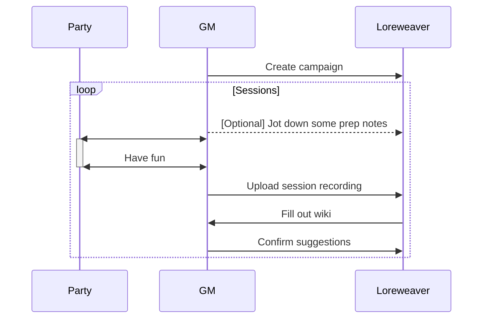

You run a session. The party meets three new NPCs, visits two locations, and makes an alliance with a faction you improvised on the spot. Great session. Now you need to remember all of that — who those NPCs were, what they said, how they connect to everything else in your world.

Maybe you're like me and trying keep it all in your head. Or maybe you're juggling some combination of Google Docs, OneNote, Notion, Trello, a wiki, and/or a spreadsheet for NPCs. None of these tools talk to each other, and none of them understand what a "campaign" actually is.

Either you spend hours after every session updating your notes, or you let things slip and hope your players don't notice.

World-building tools like WorldAnvil and Kanka exist, but they expect you to build and maintain a wiki as a separate hobby alongside actually running your game. For most GMs, that's not sustainable.

## The Vision

The primary artifact of a campaign is the time we spend with friends and family at the table - physical or virtual. Everything else - the NPCs, the locations, the factions, the lore - is derived from that lived experience.

If we can capture what happens at the time through tools like audio recording, transcriptions, the GM's prep work, and players' notes, then the knowledge base should assemble itself. The GM's job shifts from authoring a wiki to running the game and reviewing what an app extracted.

## How It Works

You open a browser, log in, and you're working. No software to install, no files to manage.

### After a Session

This is the core loop - the thing you'd do after every session:

1. **Upload your audio or video recording and/or notes** from the session
   - **Optionally** players add their characters' notes, too
2. **Loreweaver processes everything** - it transcribes audio, figures out what happened, and drafts a write-up of the session
3. **You get a list of proposals**: "I found 3 new NPCs. I think Kael frequents the Rusty Anchor. Tormund appears to be dead now. Here's a draft of what happened."
4. **You review**: accept the ones that look right, tweak the ones that are close, skip the ones you don't care about
5. **Done.** Your campaign wiki just grew, and it took 15–30 minutes instead of hours

### Before a Session

When you're prepping for the next session, you can ask Loreweaver for help:

- "What loose threads did we leave hanging last session?"
- "The party is heading to Grimhollow - what have we established about it so far?"
- "Help me flesh out this NPC the party is about to meet"

After the session, Loreweaver can even compare what you planned to what actually happened - which is often where the most interesting world updates come from (improvised NPCs, unexpected alliances, plans that went completely sideways).

### Between Sessions

You can always build out your world manually - create locations, write NPC backstories, plan factions. Loreweaver can help with that too. But the key thing is that **you never have to**. The system works even if you only ever interact through the post-session review.

### Session Negative One

Start a campaign! Link your rules, select your templates, set your language, and go play.

Playing Starfinder? Grab templates for Party Members, NPCs, Spaceships, Planets, Ports, and Dungeons. Playing Daggerheart? Skip the spaceships and planets but add Factions, Myths,

## Your Campaign Wiki

As you play sessions, your campaign wiki grows automatically. It contains:

- **Sessions** - the write-up of what happened each time you played, organized chronologically
- **Arcs** - optional groupings across sessions (like chapters: "The Siege of Grimhollow" spanning sessions 7-12)
- **Things** - every entity in your world: NPCs, locations, items, factions, monsters, lore. Each one has its own page that accumulates detail over time
- **Connections** - how things relate to each other: "Clericman worships Murdergod," "Kael frequents the Rusty Anchor," "The Silver Compact is allied with the Crown of Ashenmoor"

Everything is linked together. When your session write-up mentions "the party met Kael at the Rusty Anchor," both Kael and the Rusty Anchor become clickable links to their pages. When you're looking at Kael's page, you can see every session he appeared in.

### What Players See

You control exactly what your players can see. By default, everything starts hidden - only visible to you. You reveal things to players as they come up in play.

This means you can have secret notes on an NPC that your players can look up freely, without worrying they'll stumble on spoilers. The Good Cleric that worships the god of murder - spoilers! Their view of the wiki only shows what their characters would know.

Players can also:

- Look up what they know about NPCs, locations, and factions
- Ask Loreweaver questions like "What do we know about the Silver Compact?" (it only answers from information they've been shown)
- Submit their own session recollections to help fill in gaps
- Edit their own character pages

## What Makes It Different

**It meets you where you are.** You don't have to build a wiki before session 1. An NPC can start as nothing more than a name mentioned once in a session, and grow into a fully detailed character over time as they keep showing up.

**It's tolerant of neglect.** Skip a week of reviews? That's fine. Unreviewed suggestions expire after about a week and quietly go away. The system never buries you under an infinite pile of homework.

**The AI proposes, you decide.** The AI never changes your world on its own. Every suggestion needs your approval. And every suggestion comes with the reasoning behind it, so you can always see why the AI thought something was worth proposing.

**It captures the mess.** Retconned something? No problem. Loreweaver lets you mark things as "this was established in play but we've since decided it didn't happen." The history is preserved, but Loreweaver stops treating it as current. Your campaign's contradictions and course corrections are part of the story.

## Self-Hosting

Loreweaver uses AI heavily as connective tissue to understand your game. I never sell your data and I never use it for training models - I just want to solve a problem I have.

However, if you're still worried about that, Loreweaver is open source. The default way to use it is through the hosted version (sign up, start using it), but if you want to run it on your own server, you can. Same app, same features. You'll have to provide your own AI using tools via local AI tools like Ollama.
