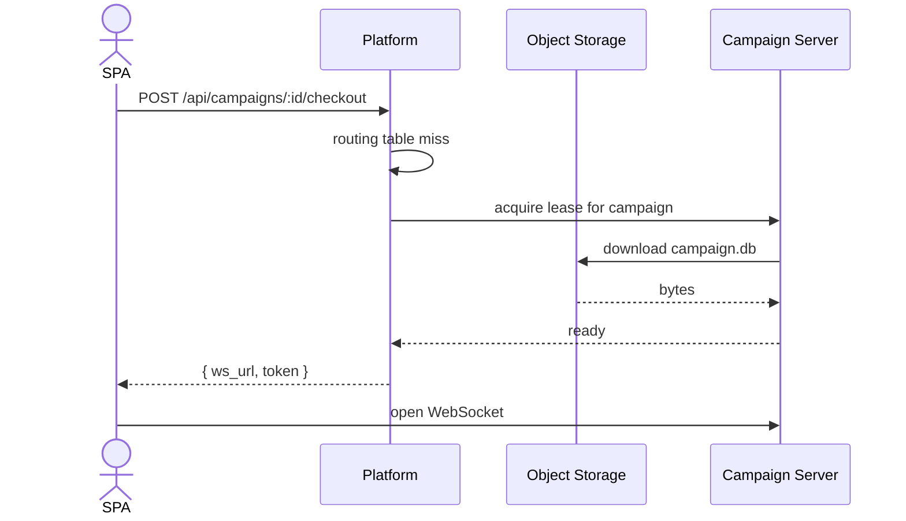
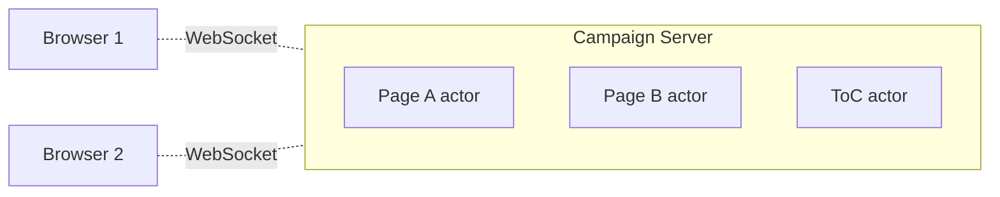
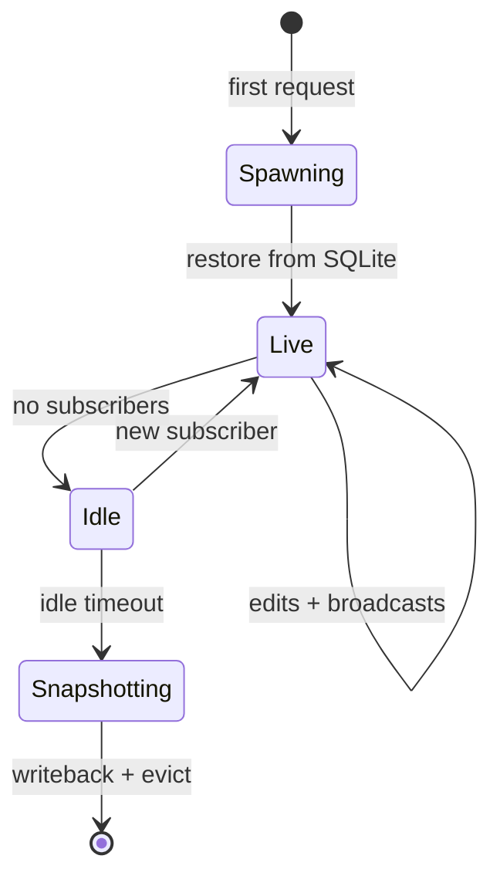
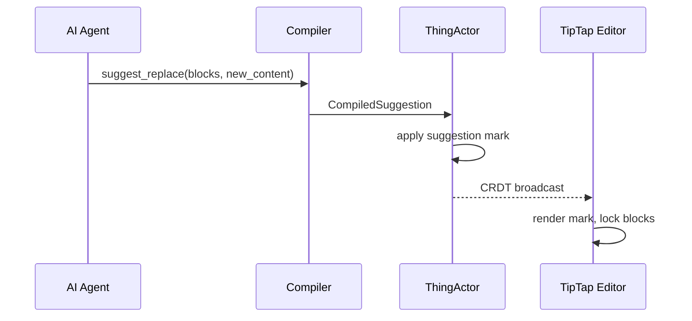
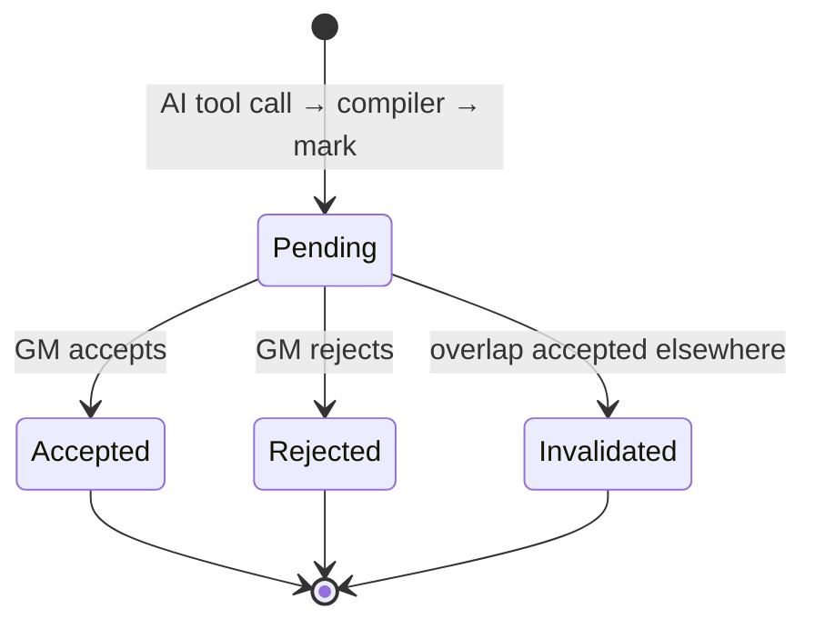

Picture a Tuesday night. You haven't touched your campaign in two weeks: real life, a holiday, overtime at work. Your Blades crew is arriving in twenty minutes for the next phase of the Crow's Foot job. You open the browser tab, click into the campaign, and start scribbling last-minute notes for the warehouse the crew is going to hit. One of your players is on the train, opens her character on her phone, and updates her playbook because she remembered she swapped out a stress for an item last session. The page she's editing isn't a page you've opened in months.

This post is about what happens between "I want to play tonight" and the cursor blinking inside a paragraph that someone else is also editing. It's about the systems that power familiar.systems.

{/* IMAGE TODO: opening-scene illustration. A GM at a desk with notes, screen, dice, half-finished session prep; suggestion of another participant on a phone in the corner. Mood-setter, not technical. */}

## A campaign is a database

Whether you're running a module like Curse of Strahd or a living world like the 7th job a crew has run in Duskvol in Blades of the Dark, your campaign/living world is a single, self-contained, mostly-cold dataset.

Some shape:

- A campaign is a few thousand pages at most: NPCs, locations, factions, items, journal entries. Plus the embeddings to search across them, and the relationship edges that tie them together. None of these are large; the whole campaign tends to fit comfortably in tens of megabytes.
- Campaigns don't query each other. A goblin in your friend's Daggerheart campaign has nothing to say about a goblin in my Mines of Phandelver short.
- Most campaigns are dormant most of the time. They wake up for a few hours one evening a week, and even during a session only a handful of pages are touched.
- The "users" of a campaign are at about six people who already trust each other, West Marches excluded.

Given all of that, we treat each campaign as one [SQLite](https://www.sqlite.org/) file. Vector search lives in the same file via [`sqlite-vec`](https://github.com/asg017/sqlite-vec). Migrations are handled by [`sea-orm`](https://www.sea-ql.org/SeaORM/), which beat [libSQL](https://github.com/tursodatabase/libsql) on ergonomics in the end (we evaluated libSQL first but we wanted an ORM). The full reasoning for one file per campaign sits in [the SQLite-over-Postgres decision doc](https://github.com/familiar-systems/familiar/blob/106dd6f48f06e0946a5428439b903f849cd20e2e/docs/discovery/2026-03-09-sqlite-over-postgres-decision.md).

{/* IMAGE TODO: a single SQLite file labeled with a campaign name (e.g. "shadows-of-doskvol.db"), sitting in object storage, with copy/move arrows showing it as small and portable. Conveys "the database is the campaign." */}

## Opening a campaign

There are two services.

The **platform** is the directory. It knows about users, campaigns, and which small server is currently holding each campaign. It is the only place in the system that holds anything resembling a global view.

The **campaign servers** are the small servers. Each holds one or more checked-out campaigns on local NVMe. They run the editing actors, take WebSocket connections, and stream collaborative edits back out.

Here's what happens when you open a campaign:

1. The SPA in your browser calls `POST /api/campaigns/:id/checkout` on the platform.
2. The platform consults its routing table: campaign id to server.
3. **Cold start.** If no server has this campaign open, the platform picks the least-loaded campaign server, asks it to acquire a lease, and the server downloads the SQLite file from object storage to its local volume.
4. **Hot start.** If a server already has it, the platform returns that assignment immediately.
5. Either way, the SPA receives a shard-agnostic URL and opens a WebSocket against it.

The lease keeps two servers from owning the same campaign at the same time. A server holds the lease as long as the campaign is open and active; it releases it only after writing back to object storage. The full shutdown protocol is in [the deployment ADR](https://github.com/familiar-systems/familiar/blob/106dd6f48f06e0946a5428439b903f849cd20e2e/docs/plans/2026-03-30-deployment-architecture.md).

Object storage is cold storage; local NVMe is the hot path. Once the file is on the campaign server's volume, every read and write hits a local disk. The same single-binary topology runs in dev, in PR previews, and in production.

{/* IMAGE TODO: hot-start variant of the cold-start sequence. Same boxes, but the platform answers from its routing table directly and the campaign server roundtrip is skipped. Shows the speed difference visually. */}

{/* IMAGE TODO: a small illustration of the routing table itself: a tiny two-column table mapping campaign ids to campaign-server addresses, with one row highlighted as "checked out." Helps the reader picture the platform's job. */}

## Editing a campaign

Once your browser has a WebSocket open against a campaign server, the rest of the system is built around one idea: every open page is its own thread.

A half-paragraph CRDT primer for anyone who hasn't met them yet. A CRDT is a data structure where two people can edit the same paragraph at the same time and converge to the same result, without locking, retries, or operational transforms. [Zed wrote a much better explanation than I could](https://zed.dev/blog/crdts) and it's worth twenty minutes if you've never built on one.

We use [Loro](https://loro.dev), a Rust CRDT library, with the `loro-prosemirror` binding so it slots into our editor, [TipTap](https://tiptap.dev) on ProseMirror.

{/* IMAGE TODO: CRDT merge cartoon. Two browser cursors on the same paragraph, concurrent edits from each, and a converged third panel showing both edits applied without conflict. Pairs with the primer. */}

Now the load-bearing part: each open page is one [kameo](https://github.com/tqwewe/kameo) actor on the campaign server. The actor owns the page's `LoroDoc` and has its own inbox. Two people on Page A and two people on Page B never contend; they're four people across two independent threads. Each thread does its own work at its own pace, and a slow page never blocks a fast one because they aren't sharing a runtime resource.

Multiple rooms ride a single socket. Each browser opens one WebSocket against the campaign server and joins rooms by id; the Loro protocol multiplexes them on the wire. There is also a top-level "table of contents" actor for the campaign's organizational structure that everyone subscribes to so the sidebar stays live.

When the last subscriber to a page leaves and an idle timer fires, the actor snapshots its `LoroDoc` into the campaign's SQLite file and evicts. The next visitor reconstructs it. CRDT state is transient; the relational data on disk is the canonical record. Blob-free at rest.

Why this fits TTRPGs. The per-page actor model is exactly the right grain. Most pages are quiet, a few are bursty during sessions, and most campaigns can share a single small server because nothing is paying for state it isn't using.

The hot path is small. A browser opens its WebSocket and the connection's read task keeps a tiny `HashMap<RoomId, RoomHandle>`. The first message for a room (a `JoinRequest`) goes through the supervisor, which spawns or hands back the page actor. Every subsequent `DocUpdate` goes straight to the actor without touching the supervisor. The supervisor is for lifecycle, not for traffic.

## The AI is a guest, not a co-author

All of the editing infrastructure above is also where AI suggestions land, but with one important rule: the AI is a guest, not a co-author.

The AI doesn't speak the CRDT protocol. It calls tools. A serialization compiler turns those tool calls (`suggest_replace`, `create_page`, `propose_relationship`) into "suggestion marks" on the relevant block UUIDs in a page's `LoroDoc`. The original content stays put; the suggestion sits next to it, scoped to the conversation that produced it.

A block under a pending suggestion is **read-only** in the editor until the GM accepts or rejects. This is the design's answer to the AI-overwrites-your-typing problem: the AI literally cannot win a race against you, because the moment it has a suggestion, your block is locked until you decide.

{/* IMAGE TODO: an editor screenshot or mockup with a suggestion mark visible. A highlighted read-only block, a floating "Accept / Reject" panel, the proposed content beneath. Concretizes this whole section. */}

Multiple agents can suggest simultaneously, even on the same blocks. The GM picks. When one is accepted, the server's classifier walks any overlapping suggestions and marks them invalidated; the editor cleans up automatically.

The slogan from [the vision doc](https://github.com/familiar-systems/familiar/blob/106dd6f48f06e0946a5428439b903f849cd20e2e/docs/vision.md) is "AI proposes, the GM disposes." This is what it means in the editor. The full mechanism (compiler, suggestion lifecycle, conversation scoping) lives in the [actor domain design](https://github.com/familiar-systems/familiar/blob/106dd6f48f06e0946a5428439b903f849cd20e2e/docs/plans/2026-03-25-campaign-actor-domain-design.md).

## What this gives us

A few things drop out of this design:

- **Campaign-as-file** means GDPR delete is `rm`. Branch deploys are `cp`. Every PR preview environment runs against real campaign data instead of fixtures.
- **One owning server per campaign** means there is no Redis, no consensus protocol, no distributed transactions. The router is a small table on the platform; that is the entire coordination story.
- **A small stateless platform** stays up while a campaign server restarts, so login and campaign discovery don't go down with the editor. Active editing on a particular campaign hiccups for a few seconds during a deploy; nothing else does.
- **Object storage as the cold backing** means we can grow or shrink the campaign-server fleet without data migration. Rebalancing a campaign is "writeback, update routing table, re-checkout elsewhere."

{/* IMAGE TODO: a small four-panel illustration of the four bullets above (one per consequence): an `rm` of a single file, a `cp` of a campaign for a PR preview, a campaign server restarting while the platform stays lit, and an arrow moving a campaign from one server to another. Tiny icons, not full diagrams. */}

## Third time's the charm

This isn't a design we're trying out. We've built it twice already.

The first time was in TypeScript on [Hocuspocus](https://tiptap.dev/docs/hocuspocus/getting-started/overview), [Yjs](https://yjs.dev/), Hono, and Node. It validated the principles (campaign-as-file, object storage as cold backing, per-page room, "AI proposes, the GM disposes") but the Node.js event loop forced architectural workarounds the design didn't ask for: two read paths, two write paths, manual memory pressure management. The runtime kept showing up in the design.

The second time was a Rust spike on kameo, Loro, and TipTap. Same picture, none of the workarounds. Two browsers editing the same page, suggestion marks blocking edits, accept and reject with cascade invalidation when overlapping suggestions collide, all of it end to end with passing Rust unit, TipTap unit, and Playwright e2e tests.

The third pass is what's in flight now in [`apps/campaign`](https://github.com/familiar-systems/familiar/tree/106dd6f48f06e0946a5428439b903f849cd20e2e/apps/campaign): the same architecture, but multi-tenant, with real logging, sea-orm migrations, and the full production app structure around it. Across all three passes, the principles held; the implementation got cleaner each time.

The full design lives in [the campaign collaboration architecture ADR](https://github.com/familiar-systems/familiar/blob/106dd6f48f06e0946a5428439b903f849cd20e2e/docs/plans/2026-03-25-campaign-collaboration-architecture.md), and the validation framing for the suggestion model is in [the Loro/TipTap spike plan](https://github.com/familiar-systems/familiar/blob/106dd6f48f06e0946a5428439b903f849cd20e2e/docs/plans/2026-03-25-loro-tiptap-spike.md).

{/* IMAGE TODO: a three-panel timeline of the implementations. Panel 1: TypeScript on Hocuspocus / Yjs / Node, with the workarounds drawn around it (two read paths, two write paths). Panel 2: the Rust spike on Loro / kameo, clean. Panel 3: the production port, cleaner still and labeled "multi-tenant." Conveys "we've done this three times; each time was simpler." */}
