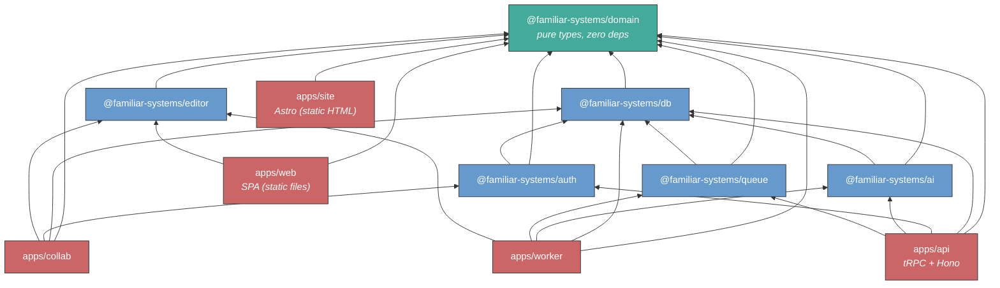

# familiar.systems - Project Structure Design (SPA)

> **Superseded** by the [Project Structure Design](../plans/2026-03-26-project-structure-design.md). This document described a TypeScript full-stack architecture with Hocuspocus, tRPC, and 5 deployment targets. The architecture has shifted to Rust (Axum + kameo + Loro) for the server, eliminating the separate API, collaboration, and TypeScript worker processes.

## Context

familiar.systems is a web application with five workloads that have **different deployment lifecycles**:

1. **Public site** (Astro) - static HTML for the landing page, blog, and public campaign showcase. No server process. Deploy = upload new files. Content changes deploy independently of the app.
2. **Frontend** (Vite + React SPA) - the authenticated application. Static files served from a CDN or file server. No server process. Deploy = upload new files. Served under `/app/`.
3. **API layer** (Hono + tRPC) - handles CRUD, interactive AI streaming, and job submission. Stateless, request-response (plus streaming for AI). Needs fast restarts and blue/green deploys.
4. **Collaboration layer** -- holds persistent WebSocket connections for real-time document editing via Loro CRDTs. Note: the [Hocuspocus Architecture ADR](../archive/plans/2026-03-14-hocuspocus-architecture.md) (now superseded by the [Campaign Collaboration Architecture](./2026-03-25-campaign-collaboration-architecture.md)) originally co-located Hono and Hocuspocus in Node.js; the new design uses a Rust binary with Axum + kameo actors, campaign-pinned.
5. **Worker layer** (AI pipeline) - dequeues long-running jobs (audio transcription, entity extraction, journal drafting). A single job may run 10+ minutes. Must survive deploys of the other four layers.

The API layer **enqueues** work; the worker **dequeues and processes** independently. Deploying the API server does not interrupt in-flight AI jobs. Deploying new static files does not affect any server process.

### Why SPA over SSR?

familiar.systems's content is entirely behind authentication (no SEO), and the centerpiece is a TipTap editor that is inherently client-rendered. Server-side rendering would produce HTML that React immediately takes over - compute spent on an HTML shell the user never sees without JavaScript. The SPA approach eliminates the server/client component boundary (no `'use client'` directives, no hydration bugs) and produces a cleaner dependency graph where the frontend structurally cannot import server-side code. See [SPA vs SSR analysis](../archive/plans/2026-02-14-spa-vs-ssr-design.md) for the full evaluation.

### Decisions made

| Decision       | Choice                                                      | Reference                                                                                                                                    |
| -------------- | ----------------------------------------------------------- | -------------------------------------------------------------------------------------------------------------------------------------------- |
| Language       | Full TypeScript (Stack A)                                   | [stack_exploration.md](../discovery/stack/stack_exploration.md)                                                                              |
| Editor         | TipTap (open-source, MIT)                                   | [tiptap.md](../discovery/stack/editor/tiptap.md)                                                                                             |
| Frontend       | React (Vite SPA)                                            | [SPA vs SSR analysis](../archive/plans/2026-02-14-spa-vs-ssr-design.md)                                                                      |
| Build tool     | Vite                                                        | [SPA vs SSR analysis](../archive/plans/2026-02-14-spa-vs-ssr-design.md)                                                                      |
| API server     | Hono + tRPC                                                 | This document                                                                                                                                |
| Database       | libSQL (database-per-campaign, Turso Database upgrade path) | [libSQL decision](../discovery/2026-03-09-sqlite-over-postgres-decision.md)                                                                  |
| ORM            | Drizzle                                                     | [stack_exploration.md](../discovery/stack/stack_exploration.md)                                                                              |
| Collaboration  | Rust: Axum + kameo actors + Loro CRDTs                      | [tiptap.md](../discovery/stack/editor/tiptap.md), [Campaign Collaboration Architecture](./2026-03-25-campaign-collaboration-architecture.md) |
| Job queue      | libSQL-backed polling table                                 | [libSQL decision](../discovery/2026-03-09-sqlite-over-postgres-decision.md)                                                                  |
| Repo structure | pnpm monorepo with Turborepo                                | [project structure design (SSR)](../archive/plans/2026-02-14-project-structure-design.md)                                                    |
| Public site    | Astro (static site generator)                               | [Public site design](./2026-02-20-public-site-design.md)                                                                                     |

---

## Repository Structure

```
familiar/
├── apps/
│   ├── site/             # Astro - landing page, blog, public campaign pages
│   ├── web/              # Vite + React SPA (static files, behind auth, served under /app/)
│   ├── api/              # Hono + tRPC - CRUD, interactive AI, job submission
│   ├── collab/           # Hocuspocus - WebSocket collaboration server
│   └── worker/           # Job consumer - dequeues and runs AI pipeline
├── packages/
│   ├── domain/           # Pure types: Node, Block, Edge, Status, Campaign, User
│   ├── db/               # Drizzle schema, migrations, query helpers
│   ├── auth/             # Token verification, permissions, session management
│   ├── editor/           # TipTap/ProseMirror schema + custom extensions
│   ├── ai/               # LLM client, prompt templates, entity extraction
│   └── queue/            # Job type definitions, polling-based producer/consumer
├── tooling/
│   ├── tsconfig/         # Shared TypeScript compiler configs
│   │   ├── base.json     # Strictness, target, module settings
│   │   ├── react.json    # Extends base, adds React + Vite JSX settings
│   │   └── library.json  # Extends base, for pure packages
│   └── oxlint/           # Shared oxlint config
│       └── base.json
├── pnpm-workspace.yaml   # Declares apps/*, packages/*, tooling/*
├── turbo.json            # Build orchestration (dependency graph, caching)
├── package.json          # Root - workspace scripts, shared devDependencies
├── .gitignore
├── .nvmrc                # Pins Node.js version
└── README.md
```

### Workspace tooling

- **pnpm** - strict dependency resolution, native workspace support. Prevents phantom dependencies: a package cannot import a dependency it hasn't declared.
- **Turborepo** - orchestrates builds across the dependency graph. Caches unchanged builds. `turbo build` rebuilds only what changed.
- **`.nvmrc`** - pins Node.js version for consistency across environments.

---

## Packages

The package layer is shared across both the SPA and [SSR design](../archive/plans/2026-02-14-project-structure-design.md) - the SPA/SSR decision affects apps, not packages. This document reflects updates to `domain`, `db`, and `ai` packages to incorporate the [AI workflow primitives](./2026-02-14-ai-workflow-unification-design.md) (suggestions, conversations, CampaignContext, tool definitions).

### Dependency graph



Arrows point from consumer to dependency ("depends on"). Green = `domain` (foundation, zero deps). Blue = packages (shared logic). Red = apps (deployment targets).

**Key structural difference from the SSR design:** `apps/web` depends on only 2 packages (`domain` and `editor`). It has no compile-time access to `db`, `auth`, `ai`, or `queue`. The client/server boundary is enforced by the dependency graph, not by convention. `apps/site` is even more minimal - it depends on `domain` only, for shared types used in public campaign pages.

**AI layer split:** `apps/api` and `apps/worker` both depend on `@familiar-systems/ai`, but for different purposes. `apps/api` uses it for interactive AI - streaming P&R and Q&A conversations through the agent window. `apps/worker` uses it for batch AI - the SessionIngest pipeline that processes audio and notes into journal drafts and entity proposals. Both use the shared `CampaignContext` interface for context retrieval with status filtering. See [AI Workflow Unification](./2026-02-14-ai-workflow-unification-design.md) for the full design.

### `@familiar-systems/domain` - Pure types, zero dependencies

```
packages/domain/src/
├── index.ts              # Public API - re-exports everything
├── campaign.ts           # Campaign, Arc, Session types
├── node.ts               # Node (Thing) types, prototype flag, prototypeId
├── block.ts              # Block types, content variants
├── edge.ts               # Relationship + Mention types
├── status.ts             # Status enum (gm_only, known, retconned)
├── user.ts               # User, Role, Permission types
├── suggestion.ts         # Suggestion, SuggestionBatch, suggestion status/type enums
└── conversation.ts       # AgentConversation, ConversationMessage, conversation role enum
```

Pure TypeScript types, enums, and status logic functions. No runtime dependencies. Every other package imports from here.

The `suggestion.ts` module defines the `Suggestion` type as a discriminated union over suggestion types (`create_thing`, `update_blocks`, `create_relationship`, `journal_draft`, `contradiction`), along with `SuggestionBatch` and the suggestion status enum (`pending`, `accepted`, `rejected`, `dismissed`). The `conversation.ts` module defines `AgentConversation`, `ConversationMessage`, and the conversation role enum (`gm`, `player`, `system`). These are the core primitives of the [AI workflow](./2026-02-14-ai-workflow-unification-design.md).

**Depends on:** nothing

### `@familiar-systems/db` - Schema, migrations, queries

```
packages/db/src/
├── index.ts              # Public API
├── schema/               # Drizzle table definitions
│   ├── nodes.ts
│   ├── blocks.ts
│   ├── relationships.ts
│   ├── mentions.ts
│   ├── sessions.ts
│   ├── campaigns.ts
│   ├── users.ts
│   ├── suggestions.ts    # suggestions + suggestion_batches tables
│   └── conversations.ts  # agent_conversations + messages tables
├── queries/              # Reusable query helpers
│   ├── graph.ts          # Traversals (recursive CTEs)
│   ├── backlinks.ts      # Mention resolution
│   └── search.ts         # Full-text search
├── migrate.ts            # Migration runner
└── client.ts             # Database connection factory
```

Drizzle ORM schema definitions and typed query helpers. Migration files (generated SQL) live in a `drizzle/` directory at the package root.

**Depends on:** `@familiar-systems/domain`, `drizzle-orm`, `@libsql/client`

The database layer uses a two-tier architecture: one platform database (`platform.db`) for users, campaigns, memberships, and the job queue, plus a separate database per campaign (`campaigns/*.db`) for all graph content. The application routes to the correct campaign database based on the request context. See [libSQL decision](../discovery/2026-03-09-sqlite-over-postgres-decision.md) for the full architecture.

### `@familiar-systems/auth` - Authentication + authorization

```
packages/auth/src/
├── index.ts
├── token.ts              # JWT/session token verification
├── permissions.ts        # "Can user X do Y on campaign Z?"
└── session.ts            # Session management (create, invalidate)
```

Shared across `apps/api` (HTTP request auth) and `apps/collab` (WebSocket connection auth). The specific auth library choice is an implementation detail encapsulated here.

**Depends on:** `@familiar-systems/domain`, `@familiar-systems/db`

### `@familiar-systems/editor` - The shared contract

```
packages/editor/src/
├── index.ts
├── schema.ts             # TipTap extensions list - THE contract
├── extensions/
│   ├── mention.ts        # Entity mention (configured Mention extension)
│   ├── status-block.ts   # Block with status attribute
│   ├── suggestion.ts     # AI suggestion marks (add/delete)
│   ├── transcluded.ts    # Transcluded block node
│   ├── stat-block.ts     # Stat block node
│   └── source-link.ts    # Source reference attribute
└── helpers/
    ├── doc-parser.ts     # Walk a Y.Doc/JSON and extract mentions
    └── doc-writer.ts     # Apply suggestion marks to a Y.Doc server-side
```

The most architecturally important package. Defines the TipTap/ProseMirror schema that both the SPA (rendering the editor in the browser) and the worker (reading/writing Y.Doc binaries on the server) must agree on.

The `helpers/` directory enables server-side document manipulation: parsing documents for mention extraction, and writing suggestion marks back into documents from the AI pipeline - all without a browser.

**Depends on:** `@familiar-systems/domain`, `@tiptap/core`, `yjs`

### `@familiar-systems/ai` - LLM orchestration

```
packages/ai/src/
├── index.ts
├── client.ts             # LLM API client (pluggable provider)
├── provider.ts           # Provider abstraction (hosted = managed keys, self-hosted = BYO)
├── context.ts            # CampaignContext interface: context retrieval + status filtering
├── tools/                # Agent tool definitions (the AI's capabilities)
│   ├── read.ts           # Search entities, get details, semantic search, session summaries
│   └── write.ts          # Propose thing, propose blocks, propose relationship, flag contradiction
├── pipelines/            # Batch processing (SessionIngest)
│   ├── transcribe.ts     # Audio → text
│   ├── journal-draft.ts  # Raw notes → structured journal draft
│   ├── entity-extract.ts # Journal → proposed entities + relationships
│   └── contradiction.ts  # Check new content against existing graph
└── prompts/              # Prompt templates (separated from logic)
    ├── journal.ts
    ├── extraction.ts
    └── contradiction.ts
```

The `provider.ts` abstraction handles the hosted vs. self-hosted requirement: the hosted instance configures managed API keys; self-hosters configure their own provider.

The `context.ts` module defines the `CampaignContext` interface - the shared contract for how the AI retrieves campaign graph content with status filtering. Both `apps/api` (interactive AI) and `apps/worker` (batch AI) instantiate a `CampaignContext` appropriate to their execution environment.

The `tools/` directory defines the agent's capabilities as tool functions. Read tools (available to all users) enable search, entity retrieval, and session summaries. Write tools (GM only) enable proposing things, relationships, block updates, and contradiction flags. The AI's behavior emerges from its tool set - Q&A uses read tools only; Planning & Refinement uses both. See [AI Workflow Unification](./2026-02-14-ai-workflow-unification-design.md) for the full design.

The `pipelines/` directory contains batch processing stages for SessionIngest - long-running jobs that run on `apps/worker`.

**Depends on:** `@familiar-systems/domain`, `@familiar-systems/db`

### `@familiar-systems/queue` - Job definitions + runner

```
packages/queue/src/
├── index.ts
├── jobs.ts               # Job type definitions (typed payloads)
├── producer.ts           # enqueue() - called by apps/api
└── consumer.ts           # Job handler registry - used by apps/worker
```

Defines typed job payloads and provides enqueue/dequeue functions backed by a polling job table in platform.db. The API server imports `producer` to enqueue; the worker imports `consumer` to dequeue and dispatch.

**Depends on:** `@familiar-systems/domain`, `@familiar-systems/db`

---

## Apps

Apps are thin deployment targets that wire packages together. Domain logic, database queries, AI prompts, and editor schema belong in packages - not in apps.

### `apps/site` - Astro (public site)

```
apps/site/
├── astro.config.ts              # Astro configuration (React integration, site URL)
├── src/
│   ├── pages/
│   │   ├── index.astro          # Landing page
│   │   ├── blog/
│   │   │   ├── index.astro      # Blog listing
│   │   │   └── [...slug].astro  # Blog post (dynamic route from content collection)
│   │   └── campaigns/
│   │       ├── index.astro      # Campaign showcase listing
│   │       └── [id].astro       # Individual public campaign page
│   ├── content/
│   │   ├── config.ts            # Content collection schemas (Zod)
│   │   └── blog/                # Markdown blog posts
│   ├── layouts/
│   │   ├── Base.astro           # HTML shell (head, meta, footer)
│   │   └── BlogPost.astro       # Blog post layout
│   └── components/              # Astro components (Header, Footer, CampaignCard)
├── public/                      # Static assets (images, favicon)
└── tsconfig.json                # Extends tooling/tsconfig/base.json
```

The public-facing site: landing page, blog, and optional campaign showcase. Generates static HTML at build time - no server process, no JavaScript by default. Blog content lives as Markdown files in `src/content/blog/` using Astro's typed content collections (frontmatter validated by Zod).

Public campaign pages are static snapshots: campaign data is fetched from `apps/api` at build time and rendered as HTML. This keeps pages fast and SEO-friendly without requiring a server runtime.

Astro supports React "islands" - interactive components that hydrate on demand - enabling shared components with `apps/web` if needed, without shipping a full React bundle to every visitor.

**Depends on:** `@familiar-systems/domain`, `astro`

### `apps/web` - Vite + React SPA

```
apps/web/
├── index.html                       # SPA shell: <div id="root"></div> + <script>
├── public/                          # Static assets (favicon, fonts)
├── vite.config.ts                   # Vite configuration (proxy, build settings)
├── src/
│   ├── main.tsx                     # Entrypoint - React root, providers, router
│   ├── routes/
│   │   ├── index.tsx                # Route tree definition
│   │   ├── auth/
│   │   │   ├── login.tsx
│   │   │   └── signup.tsx
│   │   └── campaign/
│   │       ├── layout.tsx           # Campaign shell (sidebar, nav)
│   │       ├── overview.tsx         # Campaign overview page
│   │       ├── session.$sessionId.tsx   # Session view (journal editor)
│   │       ├── thing.$thingId.tsx       # Thing page (entity editor)
│   │       ├── graph.tsx            # Graph visualization
│   │       └── settings.tsx         # Campaign settings
│   ├── components/
│   │   ├── editor/                  # TipTap editor wrapper + toolbar
│   │   ├── graph/                   # Graph visualization components
│   │   ├── agent/                   # Agent window (chat UI, streaming, @-references)
│   │   ├── review/                  # Suggestion batch review queue UI
│   │   └── ui/                      # Shared UI primitives
│   └── lib/
│       ├── trpc.ts                  # tRPC client (points to apps/api)
│       └── collab.ts                # Hocuspocus provider setup
└── tsconfig.json                    # Extends tooling/tsconfig/react.json
```

The SPA is static files. In development, `vite dev` serves files with HMR and proxies `/api/*` to `apps/api` (no CORS needed). In production, `vite build` outputs content-hashed chunks to `dist/` - upload these to a CDN or serve with nginx.

Routing is explicit via React Router or TanStack Router. The `routes/` directory is organizational, not magical - routes are registered in `routes/index.tsx`, not inferred from the filesystem.

**No `'use client'` directives.** Every component is client-side. No server/client boundary to manage.

**Depends on:** `@familiar-systems/domain`, `@familiar-systems/editor`, `react`, `@hocuspocus/provider`, `vite`

### `apps/api` - Hono + tRPC Server

```
apps/api/src/
├── index.ts                         # Server entrypoint
├── trpc/
│   ├── router.ts                    # Root router (merges all sub-routers)
│   ├── context.ts                   # Request context (auth, db connection)
│   ├── campaign.ts                  # Campaign CRUD
│   ├── session.ts                   # Session CRUD + journal management
│   ├── thing.ts                     # Thing CRUD
│   ├── graph.ts                     # Relationship + mention queries
│   ├── queue.ts                     # Job submission (enqueue background work)
│   ├── ai.ts                        # Interactive AI streaming (P&R, Q&A via agent window)
│   ├── suggestion.ts                # Suggestion CRUD (accept, reject, dismiss, list pending)
│   └── conversation.ts             # AgentConversation CRUD (create, list, get messages)
├── middleware/
│   ├── auth.ts                      # Token verification via @familiar-systems/auth
│   └── cors.ts                      # CORS headers (dev only; production uses reverse proxy)
└── config.ts                        # Server configuration (port, allowed origins)
```

The API server handles three categories of work:

1. **Standard CRUD** - request/response tRPC procedures for campaigns, sessions, things, graph queries, and job submission
2. **Interactive AI** - streaming tRPC procedures for the agent window: Planning & Refinement (GM produces suggestions interactively) and Q&A (GM or player asks questions about the campaign). The AI's behavior emerges from tool availability - GMs have read+write tools, players have read-only tools. See [AI Workflow Unification](./2026-02-14-ai-workflow-unification-design.md).
3. **Suggestion & conversation management** - CRUD for suggestions (accept, reject, dismiss, list pending, auto-rejection) and agent conversations (create, list history, get messages). These are the persistence layer for the AI workflow's durable primitives.

Hono is a lightweight HTTP framework that runs on Node.js, Deno, Bun, and Cloudflare Workers. The tRPC adapter plugs into Hono as middleware. The entire server is thin wiring - all logic lives in the packages.

**Depends on:** `@familiar-systems/domain`, `@familiar-systems/db`, `@familiar-systems/auth`, `@familiar-systems/ai`, `@familiar-systems/queue`, `hono`, `@trpc/server`

### `apps/collab` - Hocuspocus (WebSocket collaboration)

```
apps/collab/src/
├── index.ts              # Server entrypoint
├── hooks/
│   ├── auth.ts           # onAuthenticate - verify token via @familiar-systems/auth
│   ├── load.ts           # onLoadDocument - load Y.Doc from DB
│   ├── store.ts          # onStoreDocument - persist Y.Doc to DB
│   └── change.ts         # onChange - validation, mention extraction trigger
└── config.ts             # Server configuration (port)
```

Originally a Hocuspocus server with lifecycle hooks (see archived [Hocuspocus Architecture ADR](../archive/plans/2026-03-14-hocuspocus-architecture.md)). Now superseded by the [Campaign Collaboration Architecture](./2026-03-25-campaign-collaboration-architecture.md): a Rust binary using Axum + kameo actors + Loro CRDTs, with actor-per-document lifecycle replacing Hocuspocus hooks. Campaign-pinning eliminates the need for Redis scaling.

**Depends on:** `@familiar-systems/domain`, `@familiar-systems/db`, `@familiar-systems/auth`, `@familiar-systems/editor`, `@hocuspocus/server`, `yjs`

### `apps/worker` - AI pipeline runner

```
apps/worker/src/
├── index.ts                      # Entrypoint - starts the job consumer
├── handlers/
│   ├── transcribe.ts             # Handles transcribe-session jobs
│   ├── draft-journal.ts          # Handles draft-journal jobs
│   ├── extract-entities.ts       # Handles entity-extraction jobs
│   └── check-contradictions.ts   # Handles contradiction-check jobs
└── config.ts                     # Worker config (concurrency, poll interval)
```

A polling-based job consumer process. Each handler maps to a job type from `@familiar-systems/queue`, calls the corresponding pipeline from `@familiar-systems/ai`, and writes results back through `@familiar-systems/db` and `@familiar-systems/editor`.

**Depends on:** `@familiar-systems/domain`, `@familiar-systems/db`, `@familiar-systems/ai`, `@familiar-systems/queue`, `@familiar-systems/editor`

---

## Deployment

### Production topology

```
                    ┌──────────────────────┐
                    │    Reverse Proxy      │
                    │ Traefik (k3s Ingress) │
                    └──────┬───────────────┘
                           │
         ┌─────────────────┼─────────────────┐
         │        │        │                 │
         ▼        ▼        ▼                 ▼
  ┌──────────┐ ┌────────────┐ ┌────────────┐ ┌────────────┐
  │apps/site │ │  apps/web  │ │  apps/api  │ │ apps/collab│
  │ (static) │ │  (static)  │ │  (tRPC)    │ │ (WebSocket)│
  │  /*      │ │  /app/*    │ │  :3001     │ │  :3002     │
  └──────────┘ └────────────┘ └─────┬──────┘ └─────┬──────┘
                                    │               │
                                    ▼               ▼
                              ┌──────────────────────┐
                              │  libSQL files (/data/)│
                              └──────────────────────┘
                                    ▲
                                    │
                              ┌─────┴──────┐
                              │ apps/worker│
                              │ (consumer) │
                              └────────────┘
```

Traefik (via k3s Ingress) sits in front and routes (order matters - specific paths match first):

- `/app/api/*` → `apps/api` (port 3001)
- `/app/collab/*` → `apps/collab` (port 3002, WebSocket upgrade)
- `/app/*` → `apps/web` static files (SPA fallback: unknown paths serve `/app/index.html`)
- `/*` → `apps/site` static files (landing page, blog, public campaign pages)

All five concerns share a single domain from the user's perspective. No CORS in production. See [Public Site Design](./2026-02-20-public-site-design.md) for the routing rationale.

### Development

In development, each app runs its own dev server. The SPA proxies API and collab requests:

```typescript
// apps/web/vite.config.ts
export default defineConfig({
    base: "/app/",
    server: {
        proxy: {
            "/app/api": {
                target: "http://localhost:3001",
                rewrite: (path) => path.replace(/^\/app/, ""),
            },
            "/app/collab": {
                target: "ws://localhost:3002",
                ws: true,
                rewrite: (path) => path.replace(/^\/app/, ""),
            },
        },
    },
});
```

All servers run simultaneously (orchestrated by Turborepo: `turbo dev`):

- `apps/site` (Astro): `http://localhost:4321` - landing page, blog
- `apps/web` (Vite): `http://localhost:5173/app/` - the SPA
- `apps/api` (Hono): `http://localhost:3001`
- `apps/collab` (Hocuspocus): `ws://localhost:3002`

---

## Tooling

| Concern                | Tool                       | Notes                                                                                                                                             |
| ---------------------- | -------------------------- | ------------------------------------------------------------------------------------------------------------------------------------------------- |
| Package manager        | **pnpm**                   | Strict dependency resolution, native workspaces. Prevents phantom dependencies.                                                                   |
| Monorepo orchestration | **Turborepo**              | Understands the package dependency graph. Caches unchanged builds. `turbo build` rebuilds only what changed.                                      |
| Frontend build         | **Vite**                   | Dev server with HMR, production build with content-hashed chunks. Part of the VoidZero ecosystem (same as Vitest, oxlint, oxfmt).                 |
| Type checking          | **tsc** (`strict: true`)   | The TypeScript compiler. Key flags: `strict`, `noUncheckedIndexedAccess`, `noUnusedLocals`, `noUnusedParameters`, `exactOptionalPropertyTypes`.   |
| Runtime validation     | **Zod**                    | TypeScript types are erased at runtime. Zod validates data at system boundaries (API inputs, DB rows, env vars).                                  |
| Testing                | **Vitest**                 | Native TypeScript support, fast, Jest-compatible API. Shares Vite's transform pipeline.                                                           |
| Dev runner             | **tsx**                    | Runs `.ts` files directly via esbuild. No compile step during development. Used by `apps/api`, `apps/collab`, `apps/worker`.                      |
| Linting                | **oxlint 1.0**             | Rust-based, 520+ built-in rules, 50-100x faster than ESLint. Strictest config from day one.                                                       |
| Type-aware linting     | **tsgolint** (when stable) | Uses tsgo (Microsoft's official Go port of TypeScript). Real TS type system, not a reimplementation. Currently alpha - enable when it stabilizes. |
| Formatting             | **oxfmt** (alpha)          | Rust-based, Prettier-compatible, 30x faster than Prettier. Fallback to Prettier if needed (compatible output).                                    |

### Type checking strategy

TypeScript's `strict: true` enables a bundle of ~10 strict flags. Combined with additional flags, this is the equivalent of basedpyright's strict mode:

- `strict: true` - all standard strict checks
- `noUncheckedIndexedAccess` - `array[0]` is `T | undefined`, not `T`
- `exactOptionalPropertyTypes` - distinguishes `undefined` from "property missing"
- `noUnusedLocals` + `noUnusedParameters` - dead code detection

TypeScript types are erased at runtime (the compiled JavaScript has no type information). Zod fills this gap at system boundaries - API inputs, database rows, environment variables - the same role Pydantic plays in Python.

### Linting strategy

**oxlint** (stable, 1.0) for all lint rules from day one. Strictest configuration - ban `any`, enforce exhaustive switches, require explicit return types at module boundaries.

**tsgolint** for type-aware rules (e.g., `no-floating-promises`, `no-misused-promises`, `await-thenable`) when it reaches stable. tsgolint wraps tsgo - Microsoft's official Go port of the TypeScript compiler - so type-aware rules use the real TypeScript type system, not a reimplementation. This guarantees full alignment with `tsc`'s behavior.

**oxfmt** (alpha) for formatting. Prettier-compatible output, so falling back to Prettier is a one-line config change if needed. Default `printWidth: 100` (oxfmt's default, sensible for TypeScript).

All three tools are from the [oxc](https://oxc.rs/) ecosystem (VoidZero). The bet: oxc is building the all-in-one Rust-based toolchain for TypeScript, with the architectural advantage of using the official TypeScript compiler for type information rather than reimplementing it.

### Compilation

In development, `tsx` runs server-side TypeScript files directly (no compile step) for `apps/api`, `apps/collab`, and `apps/worker`. `vite dev` handles `apps/web` with native ESM and HMR. In CI and production, `tsc --noEmit` type-checks without emitting, and Vite handles production bundling for the SPA. Server-side apps are compiled by `tsx` or `tsup` for production builds.

---

## Design Principles

**Packages = shared logic, apps = deployment targets.** If you're writing domain logic, database queries, or AI prompts in an app, it belongs in a package.

**Dependency direction flows toward `domain`.** Every package can import `@familiar-systems/domain`. No package imports from an app. If two packages need to share something, it moves to a package they both depend on (usually `domain`).

**Each package's `src/index.ts` is its public API.** Other packages import from `@familiar-systems/db`, not from `@familiar-systems/db/src/schema/nodes`. Anything not re-exported from `index.ts` is a private implementation detail.

**The dependency graph enforces the client/server boundary.** `apps/web` depends on `domain` and `editor` - nothing else. It cannot import database schemas, auth internals, or queue logic. This is not a convention; it is a structural guarantee. Server-side concerns are unreachable from the frontend at compile time.

**Maximum strictness, no exceptions.** TypeScript `strict: true`, `noUncheckedIndexedAccess`, `exactOptionalPropertyTypes`, lint ban on `any`, Zod at every system boundary. pnpm's strict dependency resolution prevents phantom imports. The compiler is the first line of defense - if it compiles, the type-level guarantees are real. We do not weaken these settings.
