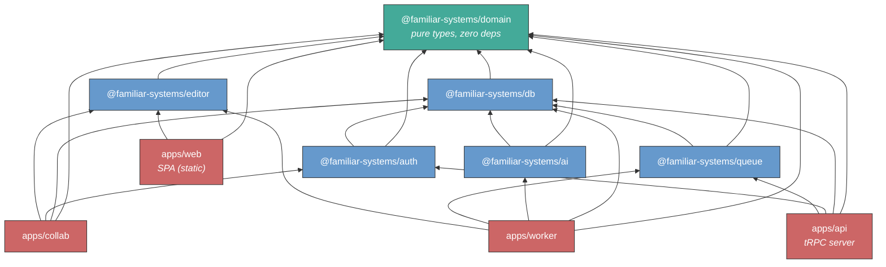

# familiar.systems — SPA vs SSR Architecture Decision

> **Decided: SPA.** This analysis evaluated SSR (Next.js) against SPA (Vite + React) for familiar.systems's requirements. The conclusion — SPA is a better fit — was adopted. The current project structure reflecting this decision is the [SPA project structure](./2026-02-14-project-structure-spa-design.md).

## Context

The [project structure design](./2026-02-14-project-structure-design.md) specifies Next.js App Router as the web layer. This document re-examines that choice against familiar.systems's actual requirements and proposes a **Single-Page Application (SPA)** architecture as an alternative.

The question: does familiar.systems benefit from server-side rendering?

---

## What SSR Gives You (and Whether familiar.systems Needs It)

Server-side rendering means the server executes React components, produces HTML, and sends it to the browser. The browser then "hydrates" the HTML — attaching JavaScript event handlers so it becomes interactive. This is what Next.js App Router does by default.

| SSR benefit                                                                       | Relevant to familiar.systems? | Why / why not                                                                                                                                                                                                                                                                                                   |
| --------------------------------------------------------------------------------- | :---------------------------: | --------------------------------------------------------------------------------------------------------------------------------------------------------------------------------------------------------------------------------------------------------------------------------------------------------------- |
| **SEO** — search engines index server-rendered HTML                               |              No               | All content is behind authentication. No public pages need indexing. Campaign data is private by design.                                                                                                                                                                                                        |
| **First Contentful Paint** — users see content before JS loads                    |           Marginal            | The centerpiece is a TipTap editor — a large client-side JS application. The editor cannot render until its JavaScript loads regardless of SSR. SSR would show page chrome (nav, sidebar) slightly faster, but the content the user came for (the editor, the graph, the review queue) waits for JS either way. |
| **Social previews / Open Graph** — link previews on Discord, Slack                |              No               | Campaign content is private. Shared links would at most show a login page.                                                                                                                                                                                                                                      |
| **Streaming / progressive rendering** — show partial content while the rest loads |           Marginal            | Useful for data-heavy dashboards. familiar.systems's pages are editor-centric, not content-list-centric. The editor loads as a unit, not progressively.                                                                                                                                                         |

**Conclusion:** The two primary motivations for SSR — SEO and first paint of content-heavy public pages — do not apply to an authenticated, editor-centric application.

---

## What SSR Costs You

### Conceptual complexity

Next.js App Router introduces a **server/client component boundary**. Components are server components by default (run on the server, cannot use hooks or browser APIs). To use React state, effects, or any browser API, you must mark a component with `'use client'`.

For familiar.systems, nearly every meaningful component is a client component:

- The TipTap editor and all its extensions → `'use client'`
- The Hocuspocus WebSocket provider → `'use client'`
- The graph visualization (canvas/SVG rendering) → `'use client'`
- The review queue (interactive accept/reject/edit) → `'use client'`
- Any component using React state or effects → `'use client'`

The server component model is designed for pages where the server can do meaningful work — fetching data, rendering content, streaming HTML. When most of your UI is interactive and client-rendered, the boundary becomes friction rather than value.

### Hydration bugs

If the server-rendered HTML doesn't exactly match what React produces client-side, React throws hydration errors. These are notoriously difficult to debug — the error message tells you _that_ a mismatch occurred, not _why_. Common causes: browser extensions modifying the DOM, locale-dependent formatting, time-dependent content.

For a developer learning React for the first time, hydration errors are a particularly hostile class of bug. They don't exist in SPAs.

### Deployment weight

Next.js requires a Node.js server running in production — it's not just static files. Every page request invokes server-side rendering logic even when the output is the same for every user. For an app where all meaningful rendering happens client-side, this is compute spent producing an HTML shell that React immediately takes over.

### Framework coupling

Next.js is the most opinionated choice in the React ecosystem. It prescribes:

- File-based routing (directory structure = URL structure)
- Data fetching patterns (Server Components, `use()`, server actions)
- Build and bundling (SWC, Turbopack)
- Middleware (edge functions for auth, redirects)
- Deployment conventions (optimized for Vercel)

These opinions are valuable when they align with your application. When they don't — when most of your app is client-rendered — they become constraints you work around rather than tools you leverage.

---

## The SPA Architecture

### How it works

```
Browser navigates to app.familiar.systems
    → CDN serves index.html (tiny shell: <div id="root"></div> + <script>)
    → Browser downloads JS bundle (content-hashed, cached aggressively)
    → React renders the entire UI client-side
    → App calls the tRPC API for data
    → Subsequent navigation is instant (React swaps components, no page reload)
```

The frontend is **static files** — HTML, JS, CSS. No server-side rendering. The API is a separate server process.

### What changes from the current design

The `apps/web` directory splits into two concerns:

| Current (Next.js)                                             | Proposed (SPA)                                          |
| ------------------------------------------------------------- | ------------------------------------------------------- |
| `apps/web` — Next.js handles both UI rendering and API routes | `apps/web` — Vite + React (static files, client-only)   |
| tRPC routers live inside Next.js as API routes                | `apps/api` — Standalone tRPC server (Hono or Fastify)   |
| One process serves pages and handles API calls                | Two processes: static file server (or CDN) + API server |

### Revised deployment model

```
┌─────────────┐
│  apps/web   │  Static files (CDN or any file server)
│  Vite SPA   │  No Node.js needed. Deploy = upload files.
└──────┬──────┘
       │ HTTPS
       ▼
┌─────────────┐     ┌──────────────┐
│  apps/api   │────▶│  PostgreSQL   │
│  tRPC/Hono  │     │              │
└─────────────┘     └──────────────┘

┌─────────────┐
│  apps/collab│  Hocuspocus (unchanged)
│  WebSocket  │
└─────────────┘

┌─────────────┐
│  apps/worker│  AI pipeline (unchanged)
│  Job runner │
└─────────────┘
```

**Four processes** instead of three. But the SPA itself requires no process in production — it's static files served from a CDN or nginx. The operational cost is the same or lower.

### Revised repository structure

```
familiar/
├── apps/
│   ├── web/              # Vite + React SPA (static files)
│   ├── api/              # tRPC server (Hono or Fastify)
│   ├── collab/           # Hocuspocus (unchanged)
│   └── worker/           # Job consumer (unchanged)
├── packages/             # (unchanged)
│   ├── domain/
│   ├── db/
│   ├── auth/
│   ├── editor/
│   ├── ai/
│   └── queue/
├── tooling/              # (unchanged)
│   ├── tsconfig/
│   │   ├── base.json
│   │   ├── react.json    # Was nextjs.json — now just React + Vite
│   │   └── library.json
│   └── oxlint/
├── pnpm-workspace.yaml
├── turbo.json
├── package.json
├── .nvmrc
└── README.md
```

### `apps/web` — Vite + React SPA

```
apps/web/src/
├── main.tsx                         # Entrypoint — React root, providers
├── routes/                          # Route definitions
│   ├── index.tsx                    # Route tree (React Router or TanStack Router)
│   ├── campaign/
│   │   ├── layout.tsx               # Campaign shell (sidebar, nav)
│   │   ├── overview.tsx             # Campaign overview page
│   │   ├── session.$sessionId.tsx   # Session view (journal editor)
│   │   ├── thing.$thingId.tsx       # Thing page (entity editor)
│   │   ├── graph.tsx                # Graph visualization
│   │   └── settings.tsx             # Campaign settings
│   └── auth/
│       ├── login.tsx
│       └── signup.tsx
├── components/                      # React components
│   ├── editor/                      # TipTap editor wrapper + toolbar
│   ├── graph/                       # Graph visualization
│   ├── review/                      # AI suggestion review queue
│   └── ui/                          # Shared UI primitives
└── lib/
    ├── trpc.ts                      # tRPC client (points to apps/api)
    └── collab.ts                    # Hocuspocus provider setup
```

**Key differences from Next.js version:**

- No `'use client'` directives — everything is client-side
- No `server/` directory — API lives in `apps/api`
- Routing is explicit (React Router or TanStack Router), not file-based
- Vite handles dev server (HMR) and production build (content-hashed chunks)

**Depends on:** `@familiar-systems/domain`, `@familiar-systems/editor`, `react`, `@hocuspocus/provider`, Vite

### `apps/api` — Standalone tRPC Server

```
apps/api/src/
├── index.ts                         # Server entrypoint (Hono or Fastify)
├── trpc/
│   ├── router.ts                    # Root router
│   ├── context.ts                   # Request context (auth, db)
│   ├── campaign.ts                  # Campaign CRUD
│   ├── session.ts                   # Session CRUD + journal management
│   ├── thing.ts                     # Thing CRUD
│   ├── graph.ts                     # Relationship + mention queries
│   └── queue.ts                     # Job submission
└── middleware/
    ├── auth.ts                      # Token verification via @familiar-systems/auth
    └── cors.ts                      # CORS for SPA origin
```

This is the `server/trpc/` directory from the Next.js design, extracted into its own deployable process. The tRPC routers are identical — they move, they don't change.

**Depends on:** `@familiar-systems/domain`, `@familiar-systems/db`, `@familiar-systems/auth`, `@familiar-systems/queue`, `hono` (or `fastify`)

### Revised dependency graph



**Notable change:** `apps/web` (the SPA) no longer depends on `@familiar-systems/db`, `@familiar-systems/auth`, or `@familiar-systems/queue`. It only needs `domain` (types) and `editor` (TipTap schema). All server-side concerns move to `apps/api`. This is a **cleaner separation** — the frontend has no access to database code, auth internals, or queue logic even at the import level.

---

## Pros and Cons

### Advantages of the SPA approach

**1. Simpler mental model for a first frontend project.**
No server/client component boundary. No hydration. No `'use client'` directives. Every component works the same way. The learning path is: React → React Router → TipTap, without the detour through Next.js's rendering model.

**2. Better caching and cheaper hosting.**
The SPA is static files. Vite produces content-hashed chunks — `editor.a1b2c3.js`, `graph.d4e5f6.js`. The browser caches these indefinitely (the hash changes when the content changes). Deploying a new version only transfers the changed chunks. In production, a CDN or nginx serves these files with zero compute cost. No Node.js server needed for the frontend.

**3. Cleaner dependency graph.**
The SPA imports only `domain` and `editor`. It has no compile-time access to database schemas, auth internals, or queue logic. In the Next.js design, `apps/web` imports everything because server-side code and client-side code coexist in the same app. The SPA architecture enforces the client/server boundary at the package level — not by convention, but by the dependency graph.

**4. Independent deployability.**
The SPA deploys independently of the API server. Upload new static files → users get the new frontend on their next page load. The API server deploys independently of the frontend. Neither restart affects the other. This is the same lifecycle separation principle that motivated splitting collab and worker from web — applied one step further.

**5. Framework independence.**
Vite + React Router has no opinions about your API layer, your data fetching strategy, or your deployment target. If React Router doesn't work out, switching to TanStack Router is a routing-layer change, not an application rewrite. The framework risk is lower because there's less framework to be locked into.

**6. Opens the door to non-Node.js runtimes.**
Without Next.js, the runtime constraint loosens. The API server (Hono) runs on Node.js, Deno, Bun, or Cloudflare Workers. The SPA doesn't care — it's static files. This doesn't change the current recommendation (Node.js + pnpm) but eliminates a hard constraint should the landscape shift.

### Disadvantages of the SPA approach

**1. Two apps instead of one for the "web" concern.**
Next.js serves both the UI and the API from a single process. The SPA approach splits this into `apps/web` (static files) and `apps/api` (tRPC server). This is one more thing to deploy, one more thing to monitor, one more URL to configure (the SPA needs to know the API server's address).

**Mitigation:** The API server is simple — a Hono server with tRPC middleware and CORS. It's comparable in complexity to `apps/collab` (~200 lines of wiring). In production, a reverse proxy (nginx, Caddy) maps `/api/*` to the API server and everything else to the static files, so the user sees a single domain.

**2. No file-based routing.**
Next.js generates routes from the filesystem — create `campaign/[campaignId]/page.tsx` and the route exists. With React Router or TanStack Router, routes are declared explicitly in code. This is more flexible but requires manual route registration.

**Mitigation:** Explicit routing is arguably better for learning — you see exactly what's happening instead of relying on convention. TanStack Router provides type-safe route parameters, which Next.js file-based routing does not.

**3. Initial page load is blank until JS executes.**
An SPA shows a blank (or loading spinner) page until the JavaScript bundle downloads and executes. On a fast connection this is imperceptible (<200ms). On a slow connection, the user stares at nothing for a moment.

**Mitigation:** The target users (GMs, players) are on desktop or laptop browsers with reasonable connections, not low-end mobile on 3G. The Vite production build is aggressively code-split — only the code for the current route loads initially. A lightweight loading shell (static HTML in `index.html`) can show branding/spinner without any JS.

**4. CORS configuration.**
When the SPA and API are served from different origins (during development, or if deployed to different subdomains), the API server must handle CORS headers. This is straightforward but is one more thing to configure correctly.

**Mitigation:** In development, Vite's dev server can proxy API requests (no CORS needed). In production, a reverse proxy on the same domain eliminates CORS entirely.

**5. Loss of Next.js ecosystem integrations.**
Next.js has built-in image optimization, font optimization, and middleware (edge functions). These are convenient but none are critical for familiar.systems:

- **Image optimization** — campaign images can be handled by a CDN or a dedicated image service. An NPC portrait doesn't need Next.js's `<Image>` component.
- **Font optimization** — can be handled by standard CSS `@font-face` with `font-display: swap`.
- **Middleware** — auth checks happen in the API server and collab server, not in an edge function.

---

## Router Choice: React Router vs TanStack Router

If the SPA approach is chosen, the client-side router matters. Two serious options:

### React Router (v7)

- The standard. Largest community, most tutorials, most Stack Overflow answers.
- Recently merged with Remix — can optionally add server-side rendering later if ever needed.
- Mature, stable API. Well-documented migration paths.

### TanStack Router

- **Type-safe route parameters.** Route params like `campaignId` are typed at the definition site and flow through to the component. No `useParams()` returning `string | undefined`.
- **Built-in search parameter management.** URL search params (`?tab=sessions&sort=date`) are validated and typed — the same discipline as Zod at API boundaries, applied to the URL.
- **File-based route generation** (optional) — can auto-generate route tree from filesystem, similar to Next.js but without SSR.
- Newer, smaller community.

**Preliminary lean:** TanStack Router aligns better with the "maximum strictness" principle — typed route params and validated search params eliminate a class of runtime errors. But this is a secondary decision that can be deferred.

---

## Recommendation

For familiar.systems, the SPA architecture is a better fit than Next.js SSR. The application is:

- Entirely behind authentication (no SEO)
- Centered on a client-rendered editor (TipTap)
- Built by a developer learning the frontend ecosystem for the first time (simpler mental model)

The SPA approach produces a **cleaner dependency graph** (frontend can't accidentally import server code), **cheaper hosting** (static files), and **less framework to learn** (no server/client component boundary, no hydration).

The cost — one additional app (`apps/api`) and explicit routing — is modest and arguably beneficial for understanding how the pieces connect.

### Impact on the project structure design

If adopted, the [project structure design](./2026-02-14-project-structure-design.md) would be updated:

1. `apps/web` changes from Next.js to Vite + React
2. `apps/api` is added as a new standalone tRPC server
3. `tooling/tsconfig/nextjs.json` becomes `react.json`
4. The decisions table updates "Frontend" from "React (Next.js App Router)" to "React (Vite SPA)"
5. The dependency graph updates to reflect the cleaner separation

---

## Sources

- [Vite](https://vite.dev/) — frontend build tool (HMR, code splitting, content-hashed output)
- [React Router](https://reactrouter.com/) — client-side routing for React
- [TanStack Router](https://tanstack.com/router) — type-safe React router with search param validation
- [Hono](https://hono.dev/) — lightweight web framework (works on Node.js, Deno, Bun, Cloudflare Workers)
- [Fastify](https://www.fastify.io/) — high-performance Node.js web framework
- [tRPC standalone adapter](https://trpc.io/docs/server/adapters/standalone) — run tRPC outside Next.js
- [Vite proxy configuration](https://vite.dev/config/server-options#server-proxy) — proxy API requests in development
