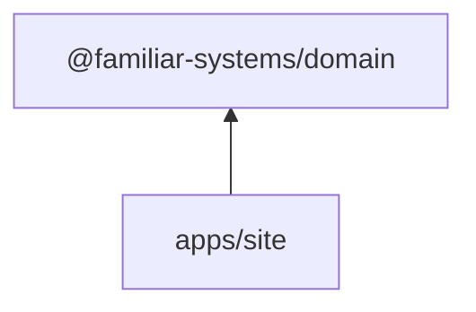

# familiar.systems - Public Site Design

## Decision

**Add `apps/site` as a deployment target** using Astro to serve the landing page, blog, and public campaign showcase pages. The public site owns the root domain (`familiar.systems`); the SPA, platform, and campaign server each get their own subdomains.

---

## Context

The existing SPA (`apps/web`) is entirely behind authentication. The [project structure design](./2026-03-26-project-structure-design.md) explicitly rejected SSR because familiar.systems's content has no SEO requirements - it's a TipTap editor that is inherently client-rendered.

A landing page and blog are the **opposite workload**: public, SEO-critical, content-heavy, and largely static. Serving them from the SPA would mean:

1. **No SEO.** SPAs serve an empty `<div id="root">` to crawlers. Google can execute JavaScript, but it's slower and penalized compared to real HTML.
2. **Unnecessary bundle weight.** First-time visitors would download the TipTap editor, graph visualization, and agent window code just to see a marketing page.
3. **Conflated lifecycles.** A blog post typo fix would trigger a rebuild of the entire app.

These problems are solved by treating the public site as its own deployment target - consistent with the project's existing pattern of separating apps by lifecycle.

---

## Why Astro

| Criterion           | Astro                                           | Next.js                                     | 11ty                             |
| ------------------- | ----------------------------------------------- | ------------------------------------------- | -------------------------------- |
| Default output      | Static HTML, zero JS                            | Requires Node.js server for SSR             | Static HTML, zero JS             |
| React components    | Yes (islands architecture)                      | Yes (full React)                            | No (template languages only)     |
| Content collections | First-class (typed Markdown/MDX)                | Manual or plugin-based                      | First-class (data cascade)       |
| Interactive embeds  | React islands hydrate on demand                 | Full hydration by default                   | Requires separate JS pipeline    |
| Complexity          | Low - static by default, opt into interactivity | High - server runtime, hydration boundaries | Low - but no component framework |

**Astro is the sweet spot.** It generates static HTML by default (same deployment model as `apps/web` - just files), but supports React islands for interactive embeds like a live campaign preview widget. Next.js brings a server runtime we don't need. 11ty is simpler but can't embed React components from a shared component library.

---

## Scope

### Landing page

Marketing content, feature showcase, pricing (if applicable). Static HTML, updated with code deploys.

### Blog

Content as Markdown files using Astro's [content collections](https://docs.astro.build/en/guides/content-collections/):

```
apps/site/src/content/blog/
├── 2026-02-20-introducing-familiar-systems.md
├── 2026-03-01-how-session-ingest-works.md
└── ...
```

Each Markdown file has typed frontmatter (title, date, summary, tags) validated by Zod via Astro's schema system. This is git-based and developer-friendly. A headless CMS can be layered in later without changing the architecture - Astro supports many CMS integrations.

### Public campaign showcase

Optional public-facing pages where GMs can showcase their campaigns. These are **static snapshots** built from campaign data:

- The Rust server exposes a public endpoint for campaign summaries (title, description, public entity count, etc.)
- `apps/site` fetches this data at build time (or via a scheduled rebuild trigger)
- Result: static HTML pages that are fast, SEO-friendly, and don't require a server runtime

This defers real-time public campaign pages until there's demand. Static snapshots rebuilt on publish are fresh enough for content that changes per-session.

---

## Routing

Path-based split within each of two apexes per environment - a marketing apex for the Astro site and an app apex for the SPA + platform + campaign. Each apex is its own browser origin:

```
familiar.systems/                                 → apps/site     (landing page, blog, public campaign showcase)
app.familiar.systems/                             → apps/web      (SPA at root, behind auth)
app.familiar.systems/api/                         → apps/platform (auth, CRUD, routing table, checkout)
app.familiar.systems/campaign/{campaign_id}/      → apps/campaign (actors, collab, AI, campaign-scoped REST + WebSocket)
```

### Reverse proxy rules (Traefik via k3s Ingress)

One IngressRoute per host. The marketing host has a single `/` rule → Astro. The app host has priority-ordered path rules (longest prefix wins): `/api` and `/campaign` each strip their prefix via `StripPrefix` middleware before reaching the backend; `/` catches everything else and serves the SPA.

### Why path-based routing within the app apex

Short answer: Hanko Cloud does not accept wildcard origins, and a per-PR subdomain scheme multiplies app origins across preview deployments. The app's services (SPA + platform + campaign) share one app apex per environment (`app.familiar.systems` in prod, `app.preview.familiar.systems` in preview); path-based routing within that apex keeps each Hanko tenant's registered-origin list to exactly one stable entry that never changes across PRs.

Same-origin between the SPA and the services it calls also eliminates CORS preflight and cross-subdomain cookie handling within the app. The marketing apex is a separate origin so its cookies, storage, and caching rules stay isolated from the app. Shard identity stays an internal concern - the platform's checkout API returns shard-agnostic URLs (`app.familiar.systems/campaign/{id}/...`) and ingress-layer routing resolves the owning shard.

See [app-server PRD §URL architecture](./2026-04-11-app-server-prd.md#url-architecture) for the full reasoning and [Deployment Architecture §URL routing](./2026-03-30-deployment-architecture.md#url-routing) for the cluster-side details.

---

## Directory Structure

```
apps/site/
├── astro.config.ts              # Astro configuration (React integration, site URL)
├── src/
│   ├── pages/
│   │   ├── index.astro          # Landing page
│   │   ├── blog/
│   │   │   ├── index.astro      # Blog listing
│   │   │   └── [...slug].astro  # Blog post (dynamic route from content collection)
│   │   └── campaigns/
│   │       ├── index.astro      # Campaign showcase listing
│   │       └── [id].astro       # Individual campaign page
│   ├── content/
│   │   ├── config.ts            # Content collection schemas (Zod)
│   │   └── blog/                # Markdown blog posts
│   ├── layouts/
│   │   ├── Base.astro           # HTML shell (head, meta, footer)
│   │   └── BlogPost.astro       # Blog post layout (title, date, reading time)
│   └── components/
│       ├── Header.astro         # Site navigation
│       ├── Footer.astro         # Site footer
│       └── CampaignCard.astro   # Campaign preview card
├── public/                      # Static assets (images, favicon)
└── tsconfig.json                # Extends tooling/tsconfig/base.json
```

---

## Dependencies



`apps/site` depends on `@familiar-systems/domain` only - for shared types used in public campaign pages (campaign title, description, entity count). No dependency on `db`, `auth`, `ai`, `queue`, or `editor`.

---

## Development

- **Dev server:** `astro dev` on port 4321 (Astro's default)
- **Turborepo:** Add to `turbo dev` pipeline alongside the other apps
- **No proxy needed:** In development, the site runs independently. The SPA and API run on their own ports as before. Cross-app links use full URLs in dev (or are relative in production behind the reverse proxy).

---

## What This Design Defers

| Decision                               | Deferred until                                                                    |
| -------------------------------------- | --------------------------------------------------------------------------------- |
| Headless CMS for blog                  | Non-developer needs to author content                                             |
| Real-time public campaign pages        | Static snapshots feel too stale                                                   |
| Shared `packages/ui` component library | Enough shared components between `apps/web` and `apps/site` to justify extraction |
| Analytics integration                  | Site has real traffic                                                             |
| i18n                                   | Demand from non-English users                                                     |

---

## References

- [Project structure](./2026-03-26-project-structure-design.md) - the 4-target architecture this design extends
- [Infrastructure](./2026-03-30-infrastructure.md) -- k3s cluster and Traefik Ingress routing
- [SPA vs SSR analysis](../archive/plans/2026-02-14-spa-vs-ssr-design.md) - why the core app is an SPA (the reasoning that creates the need for a separate public site)
