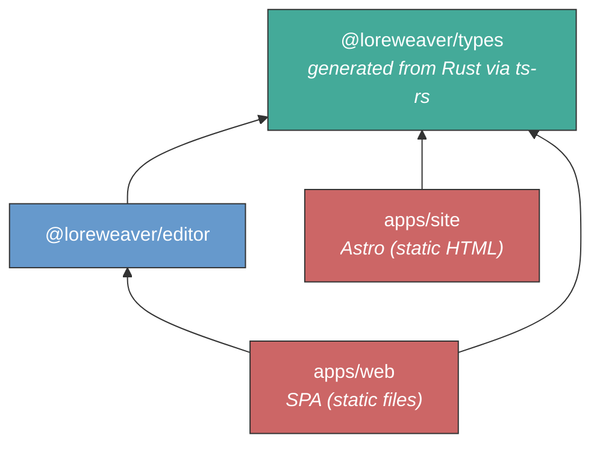

# Loreweaver -- Project Structure Design

**Status:** Draft
**Date:** 2026-03-26
**Supersedes:** [Project Structure Design (SPA)](../archive/plans/2026-02-14-project-structure-spa-design.md) -- same SPA decision, fundamentally different backend architecture (TypeScript full-stack to Rust server + TypeScript frontend + Python ML workers)
**Related decisions:** [Campaign Collaboration Architecture](./2026-03-25-campaign-collaboration-architecture.md), [Campaign Actor Domain Design](./2026-03-25-campaign-actor-domain-design.md), [AI Serialization Format v2](./2026-03-25-ai-serialization-format-v2.md), [Deployment strategy](./2026-03-12-deployment-strategy.md), [Public site design](./2026-02-20-public-site-design.md), [AI workflow unification](./2026-02-14-ai-workflow-unification-design.md), [Templates as prototype pages](./2026-02-20-templates-as-prototype-pages.md), [libSQL decision](../discovery/2026-03-09-sqlite-over-postgres-decision.md)

---

## Context

Loreweaver is a web application with four workloads that have **different deployment lifecycles**:

1. **Public site** (Astro) -- static HTML for the landing page, blog, and public campaign showcase. No server process. Deploy = upload new files.
2. **Frontend** (Vite + React SPA) -- the authenticated application. Static files served from a CDN or file server. Served under `/app/`.
3. **Server** (Rust: Axum + kameo) -- the single backend process. Handles HTTP API, WebSocket collaboration (Loro CRDTs via loro-dev/protocol), campaign checkout/checkin, actor lifecycle, AI agent conversations, and job dispatch. Campaign-pinned: all traffic for a given campaign routes to the same server.
4. **ML workers** (Python) -- audio transcription (faster-whisper) and speaker diarization (pyannote). Stateless, GPU-bound, called by the server. Results flow back via HTTP.

### Why four targets, not five

The [superseded design](../archive/plans/2026-02-14-project-structure-spa-design.md) had five: a TypeScript API server (Hono + tRPC), a Node.js collaboration server (Hocuspocus), and a TypeScript worker process alongside the static sites. Three changes collapsed those into one Rust binary:

**The API server is gone.** The Rust server handles all HTTP -- platform-level operations (user management, campaign listing) and campaign-scoped operations (suggestions, conversations, entity queries). AgentConversation actors live on the server. There is no separate stateless API process. tRPC is replaced by ts-rs (type generation from Rust) + utoipa (OpenAPI spec generation from Axum routes).

**The TypeScript worker is gone.** Campaign-scoped batch work (entity extraction, journal drafting, suggestion creation) runs through kameo actors on the server that owns the campaign checkout. Non-campaign work (audio transcription, diarization) is compute-heavy Python running on GPU infrastructure.

**Process isolation becomes actor isolation.** The old design used separate processes to prevent the collaboration server's WebSocket connections from being affected by API request load or batch processing. The Rust actor model provides the same isolation: each actor is an independent async task. No shared event loop, no memory pressure propagation between actors.

### Why SPA over SSR

Unchanged from the superseded design. Loreweaver's content is entirely behind authentication (no SEO), and the centerpiece is a TipTap editor that is inherently client-rendered. SSR would produce HTML that React immediately takes over -- compute spent on an HTML shell the user never sees without JavaScript. The campaign checkout model makes SSR worse: the server would block the page render waiting for the libSQL file to download from object storage. The SPA loads instantly from CDN and handles the async checkout gracefully. See the [SPA vs SSR analysis](../archive/plans/2026-02-14-spa-vs-ssr-design.md) for the full evaluation.

### Decisions

| Decision               | Choice                                                      | Reference                                                                                  |
| ---------------------- | ----------------------------------------------------------- | ------------------------------------------------------------------------------------------ |
| Language               | TypeScript (frontend) + Rust (server) + Python (ML workers) | This document                                                                              |
| Editor                 | TipTap (MIT, on ProseMirror)                                | [tiptap.md](../discovery/stack/editor/tiptap.md)                                           |
| Frontend               | React (Vite SPA)                                            | [SPA vs SSR analysis](../archive/plans/2026-02-14-spa-vs-ssr-design.md)                    |
| Server                 | Rust: Axum + kameo actors                                   | [Campaign Collaboration Architecture](./2026-03-25-campaign-collaboration-architecture.md) |
| CRDTs                  | Loro + loro-dev/protocol                                    | [Campaign Actor Domain Design](./2026-03-25-campaign-actor-domain-design.md)               |
| ProseMirror binding    | loro-prosemirror                                            | [Campaign Actor Domain Design](./2026-03-25-campaign-actor-domain-design.md)               |
| Database               | libSQL (database-per-campaign), Turso Database upgrade path | [libSQL decision](../discovery/2026-03-09-sqlite-over-postgres-decision.md)                |
| API contract           | ts-rs (type generation) + utoipa (OpenAPI)                  | This document                                                                              |
| Public site            | Astro (static site generator)                               | [Public site design](./2026-02-20-public-site-design.md)                                   |
| Monorepo orchestration | mise                                                        | This document                                                                              |
| TS package manager     | pnpm (strict workspaces)                                    | This document                                                                              |
| Rust build             | Cargo                                                       | This document                                                                              |
| Python tooling         | uv                                                          | This document                                                                              |

---

## Repository Structure

```
loreweaver/
├── apps/
│   ├── site/              # Astro -- landing page, blog, public campaign pages
│   └── web/               # Vite + React SPA (behind auth, served under /app/)
├── server/                # Rust binary: Axum + kameo (ALL backend)
│   ├── Cargo.toml
│   └── src/
├── packages/
│   ├── types/             # @loreweaver/types -- generated from Rust via ts-rs
│   └── editor/            # @loreweaver/editor -- TipTap schema + custom extensions
├── workers/               # Python ML workers (audio transcription, diarization)
│   ├── pyproject.toml
│   └── src/
├── tooling/
│   ├── tsconfig/          # Shared TypeScript compiler configs
│   │   ├── base.json
│   │   ├── react.json
│   │   └── library.json
│   └── oxlint/            # Shared oxlint config
│       └── base.json
├── docs/                  # Architecture decisions, design docs
├── mise.toml              # Tool versions + cross-language task orchestration
├── Cargo.toml             # Rust workspace root
├── pnpm-workspace.yaml    # TypeScript workspaces: apps/*, packages/*
└── .gitignore
```

**Why `server/` at the top level, not under `apps/`:** The Rust binary is not a pnpm workspace member. Placing it under `apps/` would suggest it participates in the TypeScript build system. The language boundary is visible in the directory tree: `apps/` and `packages/` are TypeScript (pnpm workspaces), `server/` is Rust (Cargo), `workers/` is Python (uv).

### Workspace tooling

- **mise** -- polyglot tool version manager and task runner. Pins Node.js, Rust toolchain, and Python versions in one file (`mise.toml`). Replaces `.nvmrc`. Orchestrates cross-language tasks: `mise run dev` starts all servers in parallel, `mise run build` builds all targets in dependency order, `mise run generate-types` runs the ts-rs + OpenAPI pipeline.
- **pnpm** -- TypeScript package manager with strict dependency resolution. Native workspace support via `pnpm-workspace.yaml`. Prevents phantom dependencies: a package cannot import a dependency it hasn't declared.
- **Cargo** -- Rust build system. Manages the server binary and any future sub-crates via a workspace `Cargo.toml` at the repo root.
- **uv** -- Python project manager for the ML workers. Manages virtualenvs, dependencies, and scripts via `pyproject.toml`.
- **No Turborepo.** The TypeScript workspace has two packages and two apps. mise tasks + `pnpm --filter` handle targeted builds. Turborepo's caching value doesn't justify the tooling overhead for this scale.

---

## Packages

Two TypeScript packages survive. Everything that was in `@loreweaver/domain`, `@loreweaver/db`, `@loreweaver/auth`, `@loreweaver/ai`, and `@loreweaver/queue` in the superseded design is now Rust code in `server/`.

### Dependency graph



Green = types (foundation). Blue = packages (shared logic). Red = apps (deployment targets). The Rust server and Python workers are outside the TypeScript dependency graph entirely.

### `@loreweaver/types` -- Generated types (Rust-first)

The Rust server is the source of truth for domain types. TypeScript declarations are generated via [ts-rs](https://github.com/Aleph-Alpha/ts-rs), which derives a trait on Rust types that emits `.ts` files at test time.

```
packages/types/
├── package.json           # @loreweaver/types, zero runtime dependencies
├── generated/             # ts-rs output -- machine-written, never hand-edited
│   ├── ThingId.ts
│   ├── BlockId.ts
│   ├── Suggestion.ts
│   ├── Campaign.ts
│   └── ...
└── index.ts               # Re-exports from generated/ + any TS-only helpers
```

The `generated/` directory is the output of `cargo test` on the server crate. The `index.ts` file is hand-curated: it re-exports generated types and may add TypeScript-only utilities (type guards, narrowing helpers) that don't have Rust equivalents.

**Depends on:** nothing (generated, zero runtime dependencies)

### `@loreweaver/editor` -- The shared contract

The TipTap/ProseMirror schema defines the document structure that both the browser (via loro-prosemirror) and the Rust server (for LoroDoc reconstruction and the serialization compiler) must agree on. The browser consumes this package directly. The Rust server defines its own parallel block type mappings as Rust enums, kept in sync by convention and integration tests.

```
packages/editor/src/
├── index.ts               # Public API
├── schema.ts              # TipTap extensions list -- THE contract
└── extensions/
    ├── mention.ts         # Entity mention (configured Mention extension)
    ├── status-block.ts    # Block with status attribute (gm_only, known, retconned)
    ├── suggestion-mark.ts # AI suggestion marks on block ranges
    ├── transcluded.ts     # Transcluded block node
    ├── stat-block.ts      # Stat block node
    └── source-link.ts     # Source reference attribute
```

The `helpers/` directory from the superseded design (doc-parser, doc-writer) is gone. Those were Yjs-specific utilities for server-side document manipulation. The Loro equivalents live in the Rust server's serialization compiler. See [AI Serialization Format v2](./2026-03-25-ai-serialization-format-v2.md).

**Depends on:** `@loreweaver/types`, `@tiptap/core`, `loro-prosemirror`

---

## The Rust Server

The server is a single Rust binary that owns all backend responsibilities. Its internal architecture is defined in two ADRs:

- [Campaign Collaboration Architecture](./2026-03-25-campaign-collaboration-architecture.md) -- campaign checkout/checkin, actor topology, scaling model, WebSocket architecture, suggestion model
- [Campaign Actor Domain Design](./2026-03-25-campaign-actor-domain-design.md) -- actor traits, message patterns, persistence, eviction

This section describes the server's role in the project structure, not its internal design.

### What it handles

- **HTTP API** -- platform-level (user management, campaign listing, auth token verification) and campaign-scoped (entity queries, suggestion review, conversation messages). Routes annotated with utoipa macros for OpenAPI spec generation.
- **WebSocket collaboration** -- Loro CRDTs synced via the loro-dev/protocol. Room-based multiplexing: multiple Thing pages, ToC, and agent conversation streams share one WebSocket per campaign per client.
- **Campaign checkout/checkin** -- downloads libSQL files from object storage, opens them on local disk, spawns actor trees. Single-server ownership via lease-based routing.
- **Actor lifecycle** -- CampaignSupervisor, ThingActor, TocActor, RelationshipGraph, UserSession, AgentConversation. Independent async tasks with per-actor persistence and eviction.
- **AI agent conversations** -- AgentConversation actors connect to LLM inference (Nebius), run the serialization compiler, route compiled suggestions to ThingActors. Human messages POSTed via REST.
- **Job dispatch** -- sends audio processing work to Python ML workers, receives structured transcripts, routes them to actors for entity extraction and journal drafting.
- **Type generation** -- ts-rs derives on Rust structs emit TypeScript declarations. utoipa macros on routes emit OpenAPI spec.

### Database tiers

Two-tier libSQL architecture, both owned by the server:

- **platform.db** -- users, campaigns, subscriptions, the routing table (campaign -> server assignment). Cross-campaign queries.
- **campaigns/\*.db** -- one file per campaign. Block records, entity data, relationships, search text, embeddings, suggestion outcomes, conversation history. Campaign-as-file isolation enables trivial GDPR deletion, PR preview branching (`cp`), and horizontal scaling (add servers, route campaigns).

See [libSQL decision](../discovery/2026-03-09-sqlite-over-postgres-decision.md) for the database architecture.

---

## Python ML Workers

Audio processing is compute-heavy Python work that runs on GPU infrastructure (Nebius, Finnish datacenter). It doesn't need campaign context -- it receives raw audio and returns structured output.

```
workers/
├── pyproject.toml         # Managed by uv
└── src/
    ├── transcribe.py      # faster-whisper: audio -> timestamped transcript
    └── diarize.py         # pyannote: speaker attribution on transcript
```

Workers are stateless. The Rust server calls them via HTTP with audio file references. Workers return structured transcripts with speaker attribution and timestamps. The server routes these results to actors for the campaign-scoped stages (entity extraction, journal drafting, suggestion creation) that require the campaign graph.

**Managed by:** uv (pyproject.toml, virtualenv, dependencies, scripts)

---

## Apps

### `apps/site` -- Astro (public site)

```
apps/site/
├── astro.config.ts
├── src/
│   ├── pages/
│   │   ├── index.astro              # Landing page
│   │   ├── blog/
│   │   │   ├── index.astro          # Blog listing
│   │   │   └── [...slug].astro      # Blog post (content collection)
│   │   └── campaigns/
│   │       ├── index.astro          # Campaign showcase listing
│   │       └── [id].astro           # Public campaign page
│   ├── content/
│   │   ├── config.ts                # Content collection schemas (Zod)
│   │   └── blog/                    # Markdown blog posts
│   ├── layouts/
│   └── components/
├── public/
└── tsconfig.json
```

Static HTML generated at build time. No server process. Blog content uses Astro's typed content collections. Public campaign pages are static snapshots: campaign data is fetched from the Rust server's HTTP API at build time and rendered as HTML.

**Depends on:** `@loreweaver/types`, `astro`

### `apps/web` -- Vite + React SPA

```
apps/web/
├── index.html
├── public/
├── vite.config.ts
├── src/
│   ├── main.tsx                     # Entrypoint -- React root, providers, router
│   ├── routes/
│   │   ├── index.tsx                # Route tree definition
│   │   ├── auth/
│   │   └── campaign/
│   │       ├── layout.tsx           # Campaign shell (sidebar, nav)
│   │       ├── overview.tsx
│   │       ├── thing.$thingId.tsx   # Thing page (entity editor)
│   │       ├── graph.tsx            # Graph visualization
│   │       └── settings.tsx
│   ├── components/
│   │   ├── editor/                  # TipTap editor wrapper + toolbar
│   │   ├── graph/                   # Graph visualization
│   │   ├── agent/                   # Agent window (chat UI, streaming)
│   │   ├── review/                  # Suggestion review UI
│   │   └── ui/                      # Shared UI primitives
│   └── lib/
│       ├── api.ts                   # Typed fetch client (from OpenAPI spec)
│       └── collab.ts                # loro-prosemirror provider setup
└── tsconfig.json
```

Static files. In development, `vite dev` serves files with HMR and proxies API/WebSocket requests to the Rust server. In production, `vite build` outputs content-hashed chunks -- upload to CDN or serve with nginx.

`lib/api.ts` is a typed fetch client generated from the Rust server's OpenAPI spec (via utoipa). This replaces the tRPC client from the superseded design. `lib/collab.ts` configures the loro-prosemirror binding for CRDT sync with the server.

**Depends on:** `@loreweaver/types`, `@loreweaver/editor`, `react`, `loro-prosemirror`, `vite`

---

## Type Generation Pipeline

Type safety across the Rust-TypeScript boundary is maintained through two generation pipelines:

### Domain types (ts-rs)

1. Rust structs in `server/src/` derive `#[derive(TS)]` via the ts-rs crate
2. `cargo test` emits `.ts` declarations to `packages/types/generated/`
3. `packages/types/index.ts` re-exports the generated types
4. `apps/web` and `@loreweaver/editor` import from `@loreweaver/types`

### HTTP API (utoipa + OpenAPI)

1. Axum route handlers are annotated with utoipa macros (`#[utoipa::path(...)]`)
2. `cargo test` or a build step generates an OpenAPI JSON spec
3. A frontend fetch client is generated from the spec (or hand-maintained as a thin typed wrapper)
4. `apps/web` imports the client as `lib/api.ts`

### Orchestration

`mise run generate-types` runs both pipelines. CI verifies that generated files are up-to-date (regenerate, diff, fail if dirty).

The `server/Cargo.toml` configures the ts-rs output directory:

```toml
[package.metadata.ts-rs]
output_directory = "../packages/types/generated"
```

---

## Deployment

### Production topology

```
                    ┌──────────────────────┐
                    │    Reverse Proxy      │
                    │ Traefik (k3s Ingress) │
                    └──────┬───────────────┘
                           │
              ┌────────────┼────────────┐
              │            │            │
              ▼            ▼            ▼
       ┌──────────┐ ┌────────────┐ ┌────────────────┐
       │apps/site │ │  apps/web  │ │    server/      │
       │ (static) │ │  (static)  │ │  (Rust binary)  │
       │  /*      │ │  /app/*    │ │  :3000          │
       └──────────┘ └────────────┘ │  HTTP + WS      │
                                   └───────┬─────────┘
                                           │
                                    ┌──────┴──────┐
                                    │ libSQL files │
                                    │  (/data/)    │
                                    └─────────────┘
```

Traefik (via k3s Ingress) routes on a single domain (order matters -- specific paths match first):

- `/app/api/*` -> server (port 3000, HTTP)
- `/app/ws/*` -> server (port 3000, WebSocket upgrade)
- `/app/*` -> apps/web static files (SPA fallback: unknown paths serve `/app/index.html`)
- `/*` -> apps/site static files

All four targets share a single domain. No CORS in production. Python ML workers run on separate GPU infrastructure (Nebius) and are not exposed to the internet -- the Rust server calls them directly. See [Public Site Design](./2026-02-20-public-site-design.md) for routing rationale and [Deployment Strategy](./2026-03-12-deployment-strategy.md) for infrastructure.

### Development

```
mise run dev
```

Starts all servers in parallel:

- `apps/site` (Astro): `http://localhost:4321`
- `apps/web` (Vite): `http://localhost:5173/app/`
- `server/` (cargo run): `http://localhost:3000`

Vite proxies API and WebSocket requests to the Rust server:

```typescript
// apps/web/vite.config.ts
export default defineConfig({
    base: "/app/",
    server: {
        proxy: {
            "/app/api": {
                target: "http://localhost:3000",
                rewrite: (path) => path.replace(/^\/app/, ""),
            },
            "/app/ws": {
                target: "ws://localhost:3000",
                ws: true,
                rewrite: (path) => path.replace(/^\/app/, ""),
            },
        },
    },
});
```

No Docker database container needed. libSQL files on disk. `:memory:` databases for tests.

---

## TypeScript Tooling

| Concern            | Tool                       | Notes                                                                                                      |
| ------------------ | -------------------------- | ---------------------------------------------------------------------------------------------------------- |
| Type checking      | **tsc** (`strict: true`)   | `strict`, `noUncheckedIndexedAccess`, `exactOptionalPropertyTypes`, `noUnusedLocals`, `noUnusedParameters` |
| Runtime validation | **Zod**                    | Validates data at system boundaries (API responses, WebSocket messages, env vars)                          |
| Testing            | **Vitest**                 | Native TypeScript, fast, Jest-compatible API. Shares Vite's transform pipeline.                            |
| Linting            | **oxlint 1.0**             | Rust-based, 520+ rules, strictest config. Ban `any`, enforce exhaustive switches.                          |
| Type-aware linting | **tsgolint** (when stable) | Uses tsgo (Microsoft's official Go port of TypeScript) for type-aware rules.                               |
| Formatting         | **oxfmt** (alpha)          | Prettier-compatible, 30x faster. Fallback to Prettier if needed.                                           |

Maximum strictness, no exceptions. TypeScript types are erased at runtime -- Zod fills the gap at system boundaries, the same role Pydantic plays in Python. The compiler is the first line of defense: if it compiles, the type-level guarantees are real.

---

## Design Principles

**The Rust server is the single backend.** All backend logic -- HTTP API, WebSocket collaboration, actor lifecycle, AI conversations, job orchestration, database access -- runs in one binary. Process isolation is replaced by actor isolation. There is no TypeScript server code.

**Two TypeScript packages, no more.** `@loreweaver/types` (generated from Rust) and `@loreweaver/editor` (TipTap schema). If you're writing domain logic, database queries, or AI orchestration, it's Rust in `server/`. The superseded design's `@loreweaver/db`, `@loreweaver/auth`, `@loreweaver/ai`, and `@loreweaver/queue` are gone.

**Dependency direction: web -> editor -> types.** The frontend depends on two packages. The editor depends on one. Nothing else. The dependency graph enforces the client/server boundary: `apps/web` structurally cannot import server-side code because there is no server-side TypeScript to import.

**Type safety across the language boundary.** Rust is the source of truth for domain types. ts-rs generates TypeScript declarations. utoipa generates OpenAPI specs from Axum routes. The frontend consumes both. CI verifies generated types are fresh.

**The editor package is the bridge.** The TipTap/ProseMirror schema in `@loreweaver/editor` defines the document structure that both the browser (via loro-prosemirror) and the Rust server (for LoroDoc reconstruction and the serialization compiler) must agree on. The browser consumes the TypeScript schema directly. The Rust server defines parallel block type mappings, kept in sync by convention and integration tests.

**Maximum TypeScript strictness.** `strict: true`, `noUncheckedIndexedAccess`, `exactOptionalPropertyTypes`, lint ban on `any`, Zod at every system boundary. pnpm's strict dependency resolution prevents phantom imports. These settings are not weakened.

**Three language ecosystems, one orchestrator.** TypeScript (pnpm), Rust (Cargo), Python (uv) each manage their own builds. mise orchestrates across them: tool versions, dev startup, type generation, CI tasks. No single build system tries to understand all three.
