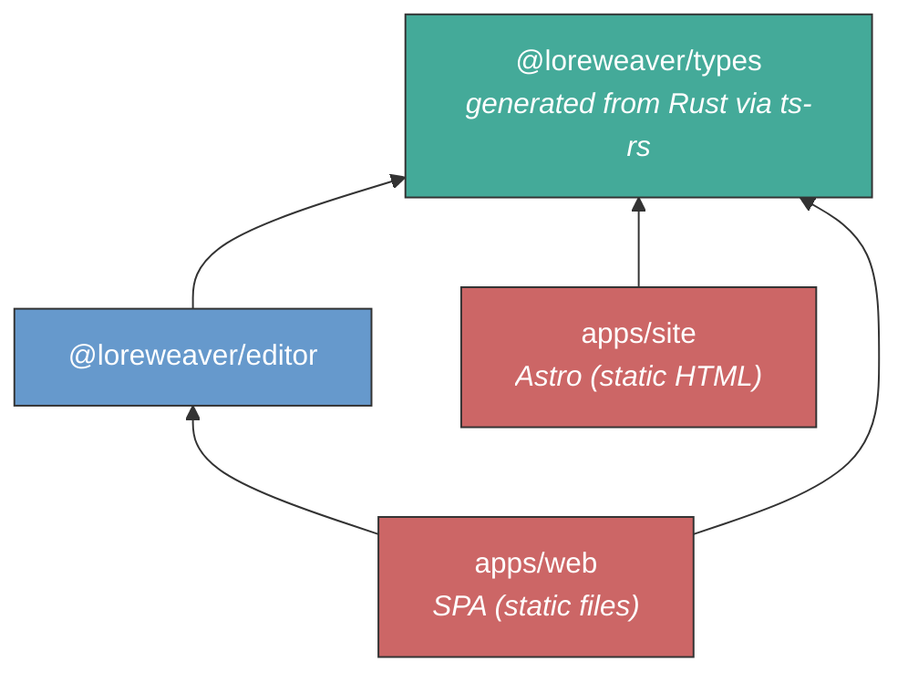

# Loreweaver -- Project Structure Design

**Status:** Implemented
**Date:** 2026-03-26
**Supersedes:** [Project Structure Design (SPA)](../archive/plans/2026-02-14-project-structure-spa-design.md) -- same SPA decision, fundamentally different backend architecture (TypeScript full-stack to Rust server + TypeScript frontend + Python ML workers)
**Related decisions:** [Campaign Collaboration Architecture](./2026-03-25-campaign-collaboration-architecture.md), [Campaign Actor Domain Design](./2026-03-25-campaign-actor-domain-design.md), [AI Serialization Format v2](./2026-03-25-ai-serialization-format-v2.md), [Infrastructure](./2026-03-30-infrastructure.md), [Deployment Architecture](./2026-03-30-deployment-architecture.md), [Public site design](./2026-02-20-public-site-design.md), [AI workflow unification](./2026-02-14-ai-workflow-unification-design.md), [Templates as prototype pages](./2026-02-20-templates-as-prototype-pages.md), [libSQL decision](../discovery/2026-03-09-sqlite-over-postgres-decision.md)

---

## Context

Loreweaver is a web application with five workloads that have **different deployment lifecycles**:

1. **Public site** (Astro) -- static HTML for the landing page, blog, and public campaign showcase. No server process. Deploy = upload new files.
2. **Frontend** (Vite + React SPA) -- the authenticated application. Static files served from a CDN or file server.
3. **Platform** (Rust: Axum) -- authentication, campaign CRUD, routing table, discover endpoint. Talks to platform.db. Stateless HTTP, rarely changes.
4. **Campaign server** (Rust: Axum + kameo) -- actor hierarchy, WebSocket collaboration (Loro CRDTs via loro-dev/protocol), AI agent conversations, serialization compiler, job dispatch. Talks to per-campaign libSQL files. Campaign-pinned: all traffic for a given campaign routes to the same server. Changes frequently.
5. **Workers** -- job processors, language-agnostic. Today: Python ML workers (faster-whisper, pyannote) on GPU infrastructure. Deployed as k8s Jobs, dispatched by the campaign server. Job state tracked in platform.db.

### Why five targets, not one backend

The [superseded design](../archive/plans/2026-02-14-project-structure-spa-design.md) had five TypeScript processes: an API server (Hono + tRPC), a collaboration server (Hocuspocus), and a worker process alongside the static sites. The Rust rewrite collapsed the three backend TypeScript processes into one Rust binary, using actor isolation (kameo) instead of process isolation.

The platform/campaign split re-introduces a process boundary, but at a different seam. The old split was functional (API vs collaboration vs worker). The new split is by deployment lifecycle:

**The platform barely changes.** It's CRUD on a SQLite file: auth, campaign listing, routing table, discover. Once written, it goes weeks without a deploy. Restarting it is transparent to users.

**The campaign server changes constantly.** It's where all the complexity lives: the actor hierarchy, CRDT sync, the serialization compiler, AI conversations. It ships daily. Restarting it disconnects active editing sessions.

**Coupling them means the stable service restarts every time the volatile one ships.** Login breaks, campaign discovery breaks, the routing table drops. With the split, a campaign server deploy or crash produces "I can't open my campaign," not "the site is down."

**The network boundary prevents invisible coupling.** Without it, six months of development creates shortcuts: the campaign server reading platform.db directly, importing platform-internal types, sharing in-process state. The eventual split becomes an archaeological dig. With the boundary from day one, the Cargo workspace's crate boundaries enforce separation at compile time, and the HTTP interface is always exercised.

**Process isolation remains for the runtime concern.** Actor isolation handles concurrent workloads within the campaign server (WebSocket connections, AI inference, CRDT sync). Process isolation handles the deployment lifecycle concern (shipping independently, blast radius). These are orthogonal.

See [Deployment Architecture](./2026-03-30-deployment-architecture.md) for the full service topology, graceful restart protocol, and preview environment design.

### Why SPA over SSR

Unchanged from the superseded design. Loreweaver's content is entirely behind authentication (no SEO), and the centerpiece is a TipTap editor that is inherently client-rendered. SSR would produce HTML that React immediately takes over -- compute spent on an HTML shell the user never sees without JavaScript. The campaign checkout model makes SSR worse: the server would block the page render waiting for the libSQL file to download from object storage. The SPA loads instantly from CDN and handles the async checkout gracefully. See the [SPA vs SSR analysis](../archive/plans/2026-02-14-spa-vs-ssr-design.md) for the full evaluation.

### Decisions

| Decision               | Choice                                                      | Reference                                                                                  |
| ---------------------- | ----------------------------------------------------------- | ------------------------------------------------------------------------------------------ |
| Language               | TypeScript (frontend) + Rust (server) + Python (ML workers) | This document                                                                              |
| Editor                 | TipTap (MIT, on ProseMirror)                                | [tiptap.md](../discovery/stack/editor/tiptap.md)                                           |
| Frontend               | React (Vite SPA)                                            | [SPA vs SSR analysis](../archive/plans/2026-02-14-spa-vs-ssr-design.md)                    |
| Server                 | Rust: Axum + kameo actors                                   | [Campaign Collaboration Architecture](./2026-03-25-campaign-collaboration-architecture.md) |
| CRDTs                  | Loro + loro-dev/protocol                                    | [Campaign Actor Domain Design](./2026-03-25-campaign-actor-domain-design.md)               |
| ProseMirror binding    | loro-prosemirror                                            | [Campaign Actor Domain Design](./2026-03-25-campaign-actor-domain-design.md)               |
| Database               | libSQL (database-per-campaign), Turso Database upgrade path | [libSQL decision](../discovery/2026-03-09-sqlite-over-postgres-decision.md)                |
| API contract           | ts-rs (type generation) + utoipa (OpenAPI)                  | This document                                                                              |
| Public site            | Astro (static site generator)                               | [Public site design](./2026-02-20-public-site-design.md)                                   |
| Monorepo orchestration | mise                                                        | This document                                                                              |
| TS package manager     | pnpm (strict workspaces)                                    | This document                                                                              |
| Rust build             | Cargo                                                       | This document                                                                              |
| Python tooling         | uv                                                          | This document                                                                              |

---

## Repository Structure

```
loreweaver/
├── apps/
│   ├── site/              # Astro -- landing page, blog, public campaign pages
│   ├── web/               # Vite + React SPA (behind auth)
│   ├── platform/          # Rust binary: Axum (auth, CRUD, routing table, discover)
│   └── campaign/          # Rust binary: Axum + kameo (actors, collab, AI, compiler)
├── crates/
│   └── shared/            # Rust library: traits, types, auth, libSQL helpers
├── packages/
│   ├── types/             # @loreweaver/types -- generated from Rust via ts-rs
│   └── editor/            # @loreweaver/editor -- TipTap schema + custom extensions
├── workers/               # Job processors (language-agnostic)
│   ├── pyproject.toml     # Python ML workers today (faster-whisper, pyannote)
│   └── src/
├── tooling/
│   ├── tsconfig/          # Shared TypeScript compiler configs
│   │   ├── base.json
│   │   ├── react.json
│   │   └── library.json
│   └── oxlint/            # Shared oxlint config
│       └── base.json
├── docs/                  # Architecture decisions, design docs
├── mise.toml              # Tool versions + cross-language task orchestration
├── Cargo.toml             # Rust workspace root (members: apps/platform, apps/campaign, crates/*)
├── pnpm-workspace.yaml    # TypeScript workspaces: apps/site, apps/web, packages/*
└── .gitignore
```

**Why Rust binaries live in `apps/`, not a separate `server/` directory:** `apps/` means "things that deploy and run," regardless of language. The Astro site, the SPA, the platform, and the campaign server are all deployable artifacts with independent lifecycles. pnpm ignores directories without `package.json`; Cargo's workspace members are listed explicitly. There's no confusion about which build system owns what. This follows the pattern used by [Spacedrive](https://github.com/spacedriveapp/spacedrive) (Rust + TypeScript monorepo) where Rust service binaries live alongside TypeScript apps.

**Why `crates/` and `packages/` stay separate:** These are shared libraries, and the ecosystem-specific naming helps: opening `crates/shared/` tells you it's Cargo; opening `packages/editor/` tells you it's pnpm. Merging them into a generic `libs/` would save one directory at the cost of that instant signal.

**Why `workers/` is organized by function, not language:** Workers are defined by what they process (audio transcription, diarization), not what language they're written in. Today they're Python because the ML libraries are Python. A Rust worker binary would live in `apps/` (it's a Cargo artifact); a Python or Go worker would live in `workers/` (it has its own toolchain).

### Workspace tooling

- **mise** -- polyglot tool version manager and task runner. Pins Node.js, Rust toolchain, and Python versions in one file (`mise.toml`). Replaces `.nvmrc`. Orchestrates cross-language tasks: `mise run dev` starts all servers in parallel, `mise run build` builds all targets in dependency order, `mise run generate-types` runs the ts-rs + OpenAPI pipeline.
- **pnpm** -- TypeScript package manager with strict dependency resolution. Native workspace support via `pnpm-workspace.yaml`. Prevents phantom dependencies: a package cannot import a dependency it hasn't declared.
- **Cargo** -- Rust build system. The workspace `Cargo.toml` at the repo root lists members across `apps/` (binaries) and `crates/` (libraries). Both platform and campaign server binaries compile from the same workspace.
- **uv** -- Python project manager for the ML workers. Manages virtualenvs, dependencies, and scripts via `pyproject.toml`.
- **No Turborepo.** The TypeScript workspace has two packages and two apps. mise tasks + `pnpm --filter` handle targeted builds. Turborepo's caching value doesn't justify the tooling overhead for this scale.

---

## Packages

Two TypeScript packages survive. Everything that was in `@loreweaver/domain`, `@loreweaver/db`, `@loreweaver/auth`, `@loreweaver/ai`, and `@loreweaver/queue` in the superseded design is now Rust code in `crates/shared/`, `apps/platform/`, and `apps/campaign/`.

### Dependency graph



Green = types (foundation). Blue = packages (shared logic). Red = apps (deployment targets). The Rust binaries, shared crate, and workers are outside the TypeScript dependency graph entirely.

### `@loreweaver/types` -- Generated types (Rust-first)

The Rust crates are the source of truth for domain types. TypeScript declarations are generated via [ts-rs](https://github.com/Aleph-Alpha/ts-rs), which derives a trait on Rust types that emits `.ts` files at test time.

```
packages/types/
├── package.json           # @loreweaver/types, zero runtime dependencies
├── generated/             # ts-rs output -- machine-written, never hand-edited
│   ├── ThingId.ts
│   ├── BlockId.ts
│   ├── Suggestion.ts
│   ├── Campaign.ts
│   └── ...
└── index.ts               # Re-exports from generated/ + any TS-only helpers
```

The `generated/` directory is the output of `cargo test` across the workspace. The `index.ts` file is hand-curated: it re-exports generated types and may add TypeScript-only utilities (type guards, narrowing helpers) that don't have Rust equivalents.

**Depends on:** nothing (generated, zero runtime dependencies)

### `@loreweaver/editor` -- The shared contract

The TipTap/ProseMirror schema defines the document structure that both the browser (via loro-prosemirror) and the campaign server (for LoroDoc reconstruction and the serialization compiler) must agree on. The browser consumes this package directly. The campaign server defines its own parallel block type mappings as Rust enums, kept in sync by convention and integration tests.

```
packages/editor/src/
├── index.ts               # Public API
├── schema.ts              # TipTap extensions list -- THE contract
└── extensions/
    ├── mention.ts         # Entity mention (configured Mention extension)
    ├── status-block.ts    # Block with status attribute (gm_only, known, retconned)
    ├── suggestion-mark.ts # AI suggestion marks on block ranges
    ├── transcluded.ts     # Transcluded block node
    ├── stat-block.ts      # Stat block node
    └── source-link.ts     # Source reference attribute
```

The `helpers/` directory from the superseded design (doc-parser, doc-writer) is gone. Those were Yjs-specific utilities for server-side document manipulation. The Loro equivalents live in the campaign server's serialization compiler. See [AI Serialization Format v2](./2026-03-25-ai-serialization-format-v2.md).

**Depends on:** `@loreweaver/types`, `@tiptap/core`, `loro-prosemirror`

---

## The Rust Backend

Two binaries and a shared crate, all in one Cargo workspace. The internal architecture of the campaign server is defined in:

- [Campaign Collaboration Architecture](./2026-03-25-campaign-collaboration-architecture.md) -- campaign checkout/checkin, actor topology, scaling model, WebSocket architecture, suggestion model
- [Campaign Actor Domain Design](./2026-03-25-campaign-actor-domain-design.md) -- actor traits, message patterns, persistence, eviction

The service topology, graceful restart protocol, and preview environment design are in the [Deployment Architecture](./2026-03-30-deployment-architecture.md).

### `apps/platform/` -- the platform service

Handles everything before a campaign opens:

- **Authentication** -- Hanko JWT verification. User identity, profiles, session management.
- **Campaign CRUD** -- create, list, delete, transfer ownership. Metadata lives in platform.db.
- **Routing table** -- maps campaign ID to campaign server address. Lease-based: each checkout is a lease with a heartbeat.
- **Discover endpoint** -- `GET /api/campaigns/:id/connect` returns `{ websocket: "wss://c1.loreweaver.no/ws", api: "https://c1.loreweaver.no/api" }`. The SPA calls this to find its campaign server.
- **Campaign server health monitoring** -- receives heartbeats, tracks load, detects failed leases.

Talks to **platform.db**: users, campaigns, subscriptions, the routing table. Stateless HTTP; traffic is bursty, short-lived requests.

### `apps/campaign/` -- the campaign server

Handles everything after a campaign is checked out:

- **WebSocket collaboration** -- Loro CRDTs synced via loro-dev/protocol. Room-based multiplexing: multiple Thing pages, ToC, and agent conversation streams share one WebSocket per campaign per client.
- **Campaign-scoped REST** -- entity queries, suggestion review, conversation messages. The SPA calls the campaign server directly for these (not through the platform).
- **Campaign checkout/checkin** -- downloads libSQL files from object storage, opens them on local disk, spawns actor trees. Single-server ownership via lease-based routing.
- **Actor lifecycle** -- CampaignSupervisor, ThingActor, TocActor, RelationshipGraph, UserSession, AgentConversation. Independent async tasks with per-actor persistence and eviction.
- **AI agent conversations** -- AgentConversation actors connect to LLM inference (Nebius), run the serialization compiler, route compiled suggestions to ThingActors.
- **Job dispatch** -- dispatches audio processing to workers (k8s Jobs on GPU infrastructure), receives structured transcripts, routes them to actors for entity extraction and journal drafting.

Talks to **campaigns/\*.db**: one file per campaign. Block records, entity data, relationships, search text, embeddings, suggestion outcomes, conversation history. Campaign-as-file isolation enables trivial GDPR deletion, PR preview branching (`cp`), and horizontal scaling (add servers, route campaigns).

### `crates/shared/` -- the interface crate

Defines the cross-service boundary: types, trait-based interfaces (`RoutingTable`, etc.), auth (JWT validation shared between both services), and libSQL helpers. The campaign server depends on `crates/shared/` and communicates with the platform exclusively through traits with a single `Remote*` implementation (HTTP calls). There is no `Local` implementation. The network boundary is always present, even in development.

### Type generation

Both binaries contribute to type generation:

- **ts-rs** -- Rust structs derive `#[derive(TS)]` and emit TypeScript declarations to `packages/types/generated/`. Domain types live in `crates/shared/`; service-specific request/response types live in each binary's crate.
- **utoipa** -- Route handlers are annotated with `#[utoipa::path(...)]`. Both the platform and campaign server generate OpenAPI specs. The SPA consumes both: `lib/api.ts` for platform calls, campaign-scoped REST uses the URL from the discover endpoint.

See [libSQL decision](../discovery/2026-03-09-sqlite-over-postgres-decision.md) for the database architecture.

---

## Python ML Workers

Audio processing is compute-heavy Python work that runs on GPU infrastructure (Nebius, Finnish datacenter). It doesn't need campaign context -- it receives raw audio and returns structured output.

```
workers/
├── pyproject.toml         # Managed by uv
└── src/
    ├── transcribe.py      # faster-whisper: audio -> timestamped transcript
    └── diarize.py         # pyannote: speaker attribution on transcript
```

Workers are stateless k8s Jobs. The campaign server dispatches them with audio file references; job state is tracked in platform.db. Workers return structured transcripts with speaker attribution and timestamps. The campaign server routes results to actors for the campaign-scoped stages (entity extraction, journal drafting, suggestion creation) that require the campaign graph. See [Deployment Architecture](./2026-03-30-deployment-architecture.md) for the job dispatch model and deferred design decisions.

**Managed by:** uv (pyproject.toml, virtualenv, dependencies, scripts)

---

## Apps

### `apps/site` -- Astro (public site)

```
apps/site/
├── astro.config.ts
├── src/
│   ├── pages/
│   │   ├── index.astro              # Landing page
│   │   ├── blog/
│   │   │   ├── index.astro          # Blog listing
│   │   │   └── [...slug].astro      # Blog post (content collection)
│   │   └── campaigns/
│   │       ├── index.astro          # Campaign showcase listing
│   │       └── [id].astro           # Public campaign page
│   ├── content/
│   │   ├── config.ts                # Content collection schemas (Zod)
│   │   └── blog/                    # Markdown blog posts
│   ├── layouts/
│   └── components/
├── public/
└── tsconfig.json
```

Static HTML generated at build time. No server process. Blog content uses Astro's typed content collections. Public campaign pages are static snapshots: campaign data is fetched from the platform's HTTP API at build time and rendered as HTML.

**Depends on:** `@loreweaver/types`, `astro`

### `apps/web` -- Vite + React SPA

```
apps/web/
├── index.html
├── public/
├── vite.config.ts
├── src/
│   ├── main.tsx                     # Entrypoint -- React root, providers, router
│   ├── routes/
│   │   ├── index.tsx                # Route tree definition
│   │   ├── auth/
│   │   └── campaign/
│   │       ├── layout.tsx           # Campaign shell (sidebar, nav)
│   │       ├── overview.tsx
│   │       ├── thing.$thingId.tsx   # Thing page (entity editor)
│   │       ├── graph.tsx            # Graph visualization
│   │       └── settings.tsx
│   ├── components/
│   │   ├── editor/                  # TipTap editor wrapper + toolbar
│   │   ├── graph/                   # Graph visualization
│   │   ├── agent/                   # Agent window (chat UI, streaming)
│   │   ├── review/                  # Suggestion review UI
│   │   └── ui/                      # Shared UI primitives
│   └── lib/
│       ├── api.ts                   # Typed fetch client (from OpenAPI spec)
│       └── collab.ts                # loro-prosemirror provider setup
└── tsconfig.json
```

Static files. In development, `vite dev` serves files with HMR and proxies platform API requests. In production, `vite build` outputs content-hashed chunks -- upload to CDN or serve with nginx.

`lib/api.ts` is a typed fetch client generated from the OpenAPI specs (via utoipa). This replaces the tRPC client from the superseded design. The SPA uses it for platform calls; campaign-scoped REST uses the URL returned by the discover endpoint. `lib/collab.ts` configures the loro-prosemirror binding for CRDT sync with the campaign server.

**Depends on:** `@loreweaver/types`, `@loreweaver/editor`, `react`, `loro-prosemirror`, `vite`

---

## Type Generation Pipeline

Type safety across the Rust-TypeScript boundary is maintained through two generation pipelines:

### Domain types (ts-rs)

1. Rust structs in `crates/shared/` (and service crates) derive `#[derive(TS)]` via the ts-rs crate
2. `cargo test` emits `.ts` declarations to `packages/types/generated/`
3. `packages/types/index.ts` re-exports the generated types
4. `apps/web` and `@loreweaver/editor` import from `@loreweaver/types`

### HTTP API (utoipa + OpenAPI)

1. Axum route handlers are annotated with utoipa macros (`#[utoipa::path(...)]`)
2. `cargo test` or a build step generates an OpenAPI JSON spec
3. A frontend fetch client is generated from the spec (or hand-maintained as a thin typed wrapper)
4. `apps/web` imports the client as `lib/api.ts`

### Orchestration

`mise run generate-types` runs both pipelines. CI verifies that generated files are up-to-date (regenerate, diff, fail if dirty).

The workspace root `Cargo.toml` configures the ts-rs output directory:

```toml
[workspace.metadata.ts-rs]
output_directory = "packages/types/generated"
```

---

## Deployment

### Production topology

```
                ┌──────────────────────────┐
                │      Reverse Proxy        │
                │  Traefik (k3s Ingress)    │
                └──────┬───────────────────┘
                       │
     ┌─────────────────┼──────────────────┐
     │                 │                  │
     ▼                 ▼                  ▼
┌──────────┐   ┌────────────┐   ┌─────────────────┐
│loreweaver│   │    app.    │   │      api.       │
│   .no    │   │loreweaver  │   │   loreweaver    │
│ (site)   │   │   .no      │   │      .no        │
│ static   │   │  (SPA)     │   │   (platform)    │
└──────────┘   │  static    │   │    :3000        │
               └────────────┘   └────────┬────────┘
                                         │ discover
                                         ▼
                                ┌─────────────────┐
                                │      c1.        │
                                │   loreweaver    │
                                │      .no        │
                                │ (campaign srv)  │
                                │    :3001        │
                                │  HTTP + WS      │
                                └────────┬────────┘
                                         │
                                  ┌──────┴──────┐
                                  │ libSQL files │
                                  │  (/data/)    │
                                  └─────────────┘
```

Traefik (via k3s Ingress) routes by subdomain:

- `loreweaver.no` -> apps/site static files
- `app.loreweaver.no` -> apps/web static files (SPA, all paths serve `index.html`)
- `api.loreweaver.no` -> platform pod (port 3000, HTTP)
- `c1.loreweaver.no` -> campaign server pod (port 3001, HTTP + WebSocket)

The SPA talks to the platform for login, campaign listing, and discover. The discover endpoint returns a campaign server URL. After discover, the SPA talks directly to the campaign server for all campaign-scoped work (WebSocket sync, REST queries, AI conversations). The platform is no longer in the request path.

Workers run on separate GPU infrastructure (Nebius) as k8s Jobs, not as persistent services. They are not exposed to the internet. See [Deployment Architecture](./2026-03-30-deployment-architecture.md) for the job dispatch model and service topology, and [Infrastructure](./2026-03-30-infrastructure.md) for cluster configuration.

### Development

```
docker compose up
```

Runs the platform and campaign server as separate containers, matching the production topology. The SPA and site run with their native dev servers for HMR:

- `apps/site` (Astro): `http://localhost:4321`
- `apps/web` (Vite): `http://localhost:5173`
- `apps/platform` (Docker): `http://localhost:3000`
- `apps/campaign` (Docker): `http://localhost:3001`

The SPA proxies platform API requests through Vite. Campaign server requests go direct (the discover endpoint returns `localhost:3001` in dev):

```typescript
// apps/web/vite.config.ts
export default defineConfig({
    server: {
        proxy: {
            "/api": {
                target: "http://localhost:3000",
            },
        },
    },
});
```

No Docker database container needed. libSQL files on disk. `:memory:` databases for tests.

---

## TypeScript Tooling

| Concern            | Tool                       | Notes                                                                                                      |
| ------------------ | -------------------------- | ---------------------------------------------------------------------------------------------------------- |
| Type checking      | **tsc** (`strict: true`)   | `strict`, `noUncheckedIndexedAccess`, `exactOptionalPropertyTypes`, `noUnusedLocals`, `noUnusedParameters` |
| Runtime validation | **Zod**                    | Validates data at system boundaries (API responses, WebSocket messages, env vars)                          |
| Testing            | **Vitest**                 | Native TypeScript, fast, Jest-compatible API. Shares Vite's transform pipeline.                            |
| Linting            | **oxlint 1.0**             | Rust-based, 520+ rules, strictest config. Ban `any`, enforce exhaustive switches.                          |
| Type-aware linting | **tsgolint** (when stable) | Uses tsgo (Microsoft's official Go port of TypeScript) for type-aware rules.                               |
| Formatting         | **oxfmt** (alpha)          | Prettier-compatible, 30x faster. Fallback to Prettier if needed.                                           |

Maximum strictness, no exceptions. TypeScript types are erased at runtime -- Zod fills the gap at system boundaries, the same role Pydantic plays in Python. The compiler is the first line of defense: if it compiles, the type-level guarantees are real.

---

## Design Principles

**All backend logic is Rust.** Two binaries (platform and campaign server) and a shared crate, all in one Cargo workspace. Actor isolation handles concurrency within the campaign server; process isolation handles deployment lifecycles between services. There is no TypeScript server code.

**Two TypeScript packages, no more.** `@loreweaver/types` (generated from Rust) and `@loreweaver/editor` (TipTap schema). If you're writing domain logic, database queries, or AI orchestration, it's Rust in `crates/` or `apps/`. The superseded design's `@loreweaver/db`, `@loreweaver/auth`, `@loreweaver/ai`, and `@loreweaver/queue` are gone.

**Dependency direction: web -> editor -> types.** The frontend depends on two packages. The editor depends on one. Nothing else. The dependency graph enforces the client/server boundary: `apps/web` structurally cannot import server-side code because there is no server-side TypeScript to import.

**Type safety across the language boundary.** Rust is the source of truth for domain types. ts-rs generates TypeScript declarations. utoipa generates OpenAPI specs from Axum routes. The frontend consumes both. CI verifies generated types are fresh.

**The editor package is the bridge.** The TipTap/ProseMirror schema in `@loreweaver/editor` defines the document structure that both the browser (via loro-prosemirror) and the campaign server (for LoroDoc reconstruction and the serialization compiler) must agree on. The browser consumes the TypeScript schema directly. The campaign server defines parallel block type mappings, kept in sync by convention and integration tests.

**Maximum TypeScript strictness.** `strict: true`, `noUncheckedIndexedAccess`, `exactOptionalPropertyTypes`, lint ban on `any`, Zod at every system boundary. pnpm's strict dependency resolution prevents phantom imports. These settings are not weakened.

**Three language ecosystems, one orchestrator.** TypeScript (pnpm), Rust (Cargo), Python (uv) each manage their own builds. mise orchestrates across them: tool versions, dev startup, type generation, CI tasks. No single build system tries to understand all three.
