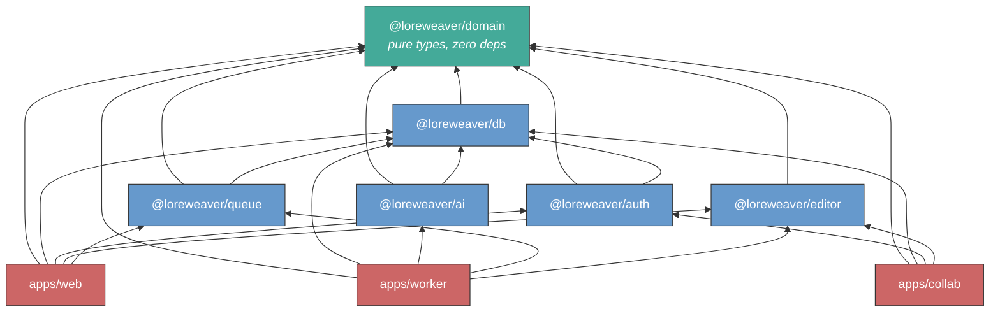

# Loreweaver — Project Structure Design

> **Superseded.** This was the original project structure based on Next.js (SSR). The [SPA vs SSR analysis](./2026-02-14-spa-vs-ssr-design.md) concluded that SSR provides no meaningful benefit for an authenticated, editor-centric application. The current authoritative structure is the [SPA project structure](../2026-02-14-project-structure-spa-design.md).

## Context

Loreweaver is a web application with three workloads that have **different deployment lifecycles**:

1. **Web layer** (Next.js) — serves pages, handles CRUD via tRPC. Stateless, request-response. Needs fast restarts and blue/green deploys.
2. **Collaboration layer** (Hocuspocus) — holds persistent WebSocket connections for real-time document editing via Yjs CRDTs. Must be a separate process because WebSockets don't survive a Next.js deploy.
3. **Worker layer** (AI pipeline) — dequeues long-running jobs (audio transcription, entity extraction, journal drafting). A single job may run 10+ minutes. Must survive deploys of the other two layers.

The web layer **enqueues** work; the worker **dequeues and processes** independently. Deploying the web server does not interrupt in-flight AI jobs.

### Decisions made

| Decision | Choice | Reference |
|---|---|---|
| Language | Full TypeScript (Stack A) | [stack_exploration.md](../../discovery/stack/stack_exploration.md) |
| Editor | TipTap (open-source, MIT) | [tiptap.md](../../discovery/stack/editor/tiptap.md) |
| Frontend | React (Next.js App Router) | [stack_exploration.md](../../discovery/stack/stack_exploration.md) |
| Database | PostgreSQL | [storage_overview.md](../../discovery/archive/2026-02-14-storage-overview.md) |
| API layer | tRPC (end-to-end type safety) | [stack_exploration.md](../../discovery/stack/stack_exploration.md) |
| ORM | Drizzle | [stack_exploration.md](../../discovery/stack/stack_exploration.md) |
| Collaboration | Hocuspocus (self-hosted Yjs server) | [tiptap.md](../../discovery/stack/editor/tiptap.md) |
| Job queue | PostgreSQL-backed (pg-boss or graphile-worker) | This document |
| Repo structure | pnpm monorepo with Turborepo | This document |

---

## Repository Structure

```
loreweaver/
├── apps/
│   ├── web/              # Next.js — UI + tRPC API routes
│   ├── collab/           # Hocuspocus — WebSocket collaboration server
│   └── worker/           # Job consumer — dequeues and runs AI pipeline
├── packages/
│   ├── domain/           # Pure types: Node, Block, Edge, Status, Campaign, User
│   ├── db/               # Drizzle schema, migrations, query helpers
│   ├── auth/             # Token verification, permissions, session management
│   ├── editor/           # TipTap/ProseMirror schema + custom extensions
│   ├── ai/               # LLM client, prompt templates, entity extraction
│   └── queue/            # Job type definitions, pg-boss wrapper
├── tooling/
│   ├── tsconfig/         # Shared TypeScript compiler configs
│   │   ├── base.json     # Strictness, target, module settings
│   │   ├── nextjs.json   # Extends base, adds Next.js requirements
│   │   └── library.json  # Extends base, for pure packages
│   └── oxlint/           # Shared oxlint config
│       └── base.json
├── pnpm-workspace.yaml   # Declares apps/*, packages/*, tooling/*
├── turbo.json            # Build orchestration (dependency graph, caching)
├── package.json          # Root — workspace scripts, shared devDependencies
├── .gitignore
├── .nvmrc                # Pins Node.js version
└── README.md
```

### Workspace tooling

- **pnpm** — strict dependency resolution, native workspace support. Prevents phantom dependencies: a package cannot import a dependency it hasn't declared.
- **Turborepo** — orchestrates builds across the dependency graph. Caches unchanged builds. `turbo build` rebuilds only what changed.
- **`.nvmrc`** — pins Node.js version for consistency across environments.

---

## Packages

### Dependency graph



Arrows point from consumer to dependency ("depends on"). Green = `domain` (foundation, zero deps). Blue = packages (shared logic). Red = apps (deployment targets).

Everything points toward `domain`. Nothing in `domain` knows about the database, the editor, or the AI pipeline.

### `@loreweaver/domain` — Pure types, zero dependencies

```
packages/domain/src/
├── index.ts              # Public API — re-exports everything
├── campaign.ts           # Campaign, Arc, Session types
├── node.ts               # Node (Thing) types, templates
├── block.ts              # Block types, content variants
├── edge.ts               # Relationship + Mention types
├── status.ts             # Status enum (gm_only, known, retconned)
└── user.ts               # User, Role, Permission types
```

Pure TypeScript types, enums, and status logic functions. No runtime dependencies. Every other package imports from here.

**Depends on:** nothing

### `@loreweaver/db` — Schema, migrations, queries

```
packages/db/src/
├── index.ts              # Public API
├── schema/               # Drizzle table definitions
│   ├── nodes.ts
│   ├── blocks.ts
│   ├── relationships.ts
│   ├── mentions.ts
│   ├── sessions.ts
│   ├── campaigns.ts
│   └── users.ts
├── queries/              # Reusable query helpers
│   ├── graph.ts          # Traversals (recursive CTEs)
│   ├── backlinks.ts      # Mention resolution
│   └── search.ts         # Full-text search
├── migrate.ts            # Migration runner
└── client.ts             # Database connection factory
```

Drizzle ORM schema definitions and typed query helpers. Migration files (generated SQL) live in a `drizzle/` directory at the package root.

**Depends on:** `@loreweaver/domain`, `drizzle-orm`, `postgres`

### `@loreweaver/auth` — Authentication + authorization

```
packages/auth/src/
├── index.ts
├── token.ts              # JWT/session token verification
├── permissions.ts        # "Can user X do Y on campaign Z?"
└── session.ts            # Session management (create, invalidate)
```

Shared across `apps/web` (HTTP request auth) and `apps/collab` (WebSocket connection auth). The specific auth library choice is an implementation detail encapsulated here.

**Depends on:** `@loreweaver/domain`, `@loreweaver/db`

### `@loreweaver/editor` — The shared contract

```
packages/editor/src/
├── index.ts
├── schema.ts             # TipTap extensions list — THE contract
├── extensions/
│   ├── mention.ts        # Entity mention (configured Mention extension)
│   ├── status-block.ts   # Block with status attribute
│   ├── suggestion.ts     # AI suggestion marks (add/delete)
│   ├── transcluded.ts    # Transcluded block node
│   ├── stat-block.ts     # Stat block node
│   └── source-link.ts    # Source reference attribute
└── helpers/
    ├── doc-parser.ts     # Walk a Y.Doc/JSON and extract mentions
    └── doc-writer.ts     # Apply suggestion marks to a Y.Doc server-side
```

The most architecturally important package. Defines the TipTap/ProseMirror schema that both the web app (rendering the editor in the browser) and the worker (reading/writing Y.Doc binaries on the server) must agree on.

The `helpers/` directory enables server-side document manipulation: parsing documents for mention extraction, and writing suggestion marks back into documents from the AI pipeline — all without a browser.

**Depends on:** `@loreweaver/domain`, `@tiptap/core`, `yjs`

### `@loreweaver/ai` — LLM orchestration

```
packages/ai/src/
├── index.ts
├── client.ts             # LLM API client (pluggable provider)
├── pipelines/
│   ├── transcribe.ts     # Audio → text
│   ├── journal-draft.ts  # Raw notes → structured journal draft
│   ├── entity-extract.ts # Journal → proposed entities + relationships
│   └── contradiction.ts  # Check new content against existing graph
├── prompts/              # Prompt templates (separated from logic)
│   ├── journal.ts
│   ├── extraction.ts
│   └── contradiction.ts
└── provider.ts           # Provider abstraction (hosted = managed keys, self-hosted = BYO)
```

The `provider.ts` abstraction handles the hosted vs. self-hosted requirement: the hosted instance configures managed API keys; self-hosters configure their own provider.

**Depends on:** `@loreweaver/domain`, `@loreweaver/db`

### `@loreweaver/queue` — Job definitions + runner

```
packages/queue/src/
├── index.ts
├── jobs.ts               # Job type definitions (typed payloads)
├── producer.ts           # enqueue() — called by apps/web
└── consumer.ts           # Job handler registry — used by apps/worker
```

Defines typed job payloads and provides enqueue/dequeue functions backed by PostgreSQL (via pg-boss or graphile-worker). The web app imports `producer` to enqueue; the worker imports `consumer` to dequeue and dispatch.

**Depends on:** `@loreweaver/domain`, `@loreweaver/db`, `pg-boss`

---

## Apps

Apps are thin deployment targets that wire packages together. Domain logic, database queries, AI prompts, and editor schema belong in packages — not in apps.

### `apps/web` — Next.js (UI + tRPC API)

```
apps/web/src/
├── app/                          # Next.js App Router
│   ├── layout.tsx                # Root layout (auth provider, theme)
│   ├── page.tsx                  # Landing / dashboard
│   ├── (auth)/                   # Auth routes (login, signup)
│   │   ├── login/page.tsx
│   │   └── signup/page.tsx
│   └── campaign/
│       └── [campaignId]/
│           ├── layout.tsx        # Campaign shell (sidebar, nav, auth check)
│           ├── page.tsx          # Campaign overview
│           ├── session/
│           │   └── [sessionId]/
│           │       └── page.tsx  # Session view (journal editor)
│           ├── thing/
│           │   └── [thingId]/
│           │       └── page.tsx  # Thing page (entity editor)
│           ├── graph/
│           │   └── page.tsx      # Graph visualization
│           └── settings/
│               └── page.tsx
├── components/                   # React components
│   ├── editor/                   # TipTap editor wrapper + toolbar
│   ├── graph/                    # Graph visualization components
│   ├── review/                   # AI suggestion review queue UI
│   └── ui/                       # Shared UI primitives
├── server/
│   ├── trpc/                     # tRPC router definitions
│   │   ├── router.ts            # Root router
│   │   ├── campaign.ts          # Campaign CRUD
│   │   ├── session.ts           # Session CRUD + journal management
│   │   ├── thing.ts             # Thing CRUD
│   │   ├── graph.ts             # Relationship + mention queries
│   │   └── queue.ts             # Job submission endpoints
│   └── context.ts               # tRPC context (auth, db connection)
└── lib/                          # Client-side utilities
    ├── trpc.ts                   # tRPC client setup
    └── collab.ts                 # Hocuspocus provider setup
```

The route structure encodes the access hierarchy: everything under `campaign/[campaignId]/` is scoped to a campaign. Middleware on the campaign layout checks access once; all child routes inherit it.

`src/server/` makes the client/server boundary explicit within Next.js.

**Depends on:** all `@loreweaver/*` packages, `next`, `react`, `@hocuspocus/provider`

### `apps/collab` — Hocuspocus (WebSocket collaboration)

```
apps/collab/src/
├── index.ts              # Server entrypoint
├── hooks/
│   ├── auth.ts           # onAuthenticate — verify token via @loreweaver/auth
│   ├── load.ts           # onLoadDocument — load Y.Doc from DB
│   ├── store.ts          # onStoreDocument — persist Y.Doc to DB
│   └── change.ts         # onChange — validation, mention extraction trigger
└── config.ts             # Server configuration (port, Redis for scaling)
```

The thinnest app. A Hocuspocus server with 4 lifecycle hooks, each delegating to the packages. The entire app may be ~200 lines of code.

**Depends on:** `@loreweaver/domain`, `@loreweaver/db`, `@loreweaver/auth`, `@loreweaver/editor`, `@hocuspocus/server`, `yjs`

### `apps/worker` — AI pipeline runner

```
apps/worker/src/
├── index.ts                      # Entrypoint — starts the job consumer
├── handlers/
│   ├── transcribe.ts             # Handles transcribe-session jobs
│   ├── draft-journal.ts          # Handles draft-journal jobs
│   ├── extract-entities.ts       # Handles entity-extraction jobs
│   └── check-contradictions.ts   # Handles contradiction-check jobs
└── config.ts                     # Worker config (concurrency, poll interval)
```

A pg-boss consumer process. Each handler maps to a job type from `@loreweaver/queue`, calls the corresponding pipeline from `@loreweaver/ai`, and writes results back through `@loreweaver/db` and `@loreweaver/editor`.

**Depends on:** `@loreweaver/domain`, `@loreweaver/db`, `@loreweaver/ai`, `@loreweaver/queue`, `@loreweaver/editor`

---

## Tooling

| Concern | Tool | Notes |
|---|---|---|
| Package manager | **pnpm** | Strict dependency resolution, native workspaces. Prevents phantom dependencies. |
| Monorepo orchestration | **Turborepo** | Understands the package dependency graph. Caches unchanged builds. `turbo build` rebuilds only what changed. |
| Type checking | **tsc** (`strict: true`) | The TypeScript compiler. Key flags: `strict`, `noUncheckedIndexedAccess`, `noUnusedLocals`, `noUnusedParameters`, `exactOptionalPropertyTypes`. |
| Runtime validation | **Zod** | TypeScript types are erased at runtime. Zod validates data at system boundaries (API inputs, DB rows, env vars). |
| Testing | **Vitest** | Native TypeScript support, fast, Jest-compatible API. |
| Dev runner | **tsx** | Runs `.ts` files directly via esbuild. No compile step during development. |
| Linting | **oxlint 1.0** | Rust-based, 520+ built-in rules, 50-100x faster than ESLint. Strictest config from day one. |
| Type-aware linting | **tsgolint** (when stable) | Uses tsgo (Microsoft's official Go port of TypeScript). Real TS type system, not a reimplementation. Currently alpha — enable when it stabilizes. |
| Formatting | **oxfmt** (alpha) | Rust-based, Prettier-compatible, 30x faster than Prettier. Fallback to Prettier if needed (compatible output). |

### Type checking strategy

TypeScript's `strict: true` enables a bundle of ~10 strict flags. Combined with additional flags, this is the equivalent of basedpyright's strict mode:

- `strict: true` — all standard strict checks
- `noUncheckedIndexedAccess` — `array[0]` is `T | undefined`, not `T`
- `exactOptionalPropertyTypes` — distinguishes `undefined` from "property missing"
- `noUnusedLocals` + `noUnusedParameters` — dead code detection

TypeScript types are erased at runtime (the compiled JavaScript has no type information). Zod fills this gap at system boundaries — API inputs, database rows, environment variables — the same role Pydantic plays in Python.

### Linting strategy

**oxlint** (stable, 1.0) for all lint rules from day one. Strictest configuration — ban `any`, enforce exhaustive switches, require explicit return types at module boundaries.

**tsgolint** for type-aware rules (e.g., `no-floating-promises`, `no-misused-promises`, `await-thenable`) when it reaches stable. tsgolint wraps tsgo — Microsoft's official Go port of the TypeScript compiler — so type-aware rules use the real TypeScript type system, not a reimplementation. This guarantees full alignment with `tsc`'s behavior.

**oxfmt** (alpha) for formatting. Prettier-compatible output, so falling back to Prettier is a one-line config change if needed. Default `printWidth: 100` (oxfmt's default, sensible for TypeScript).

All three tools are from the [oxc](https://oxc.rs/) ecosystem (VoidZero). The bet: oxc is building the all-in-one Rust-based toolchain for TypeScript, with the architectural advantage of using the official TypeScript compiler for type information rather than reimplementing it.

### Compilation

In development, `tsx` runs TypeScript files directly (no compile step). In CI and production, `tsc --noEmit` type-checks without emitting, and Next.js/SWC handles production compilation. The developer experience is: save a file, it runs.

---

## Design Principles

**Packages = shared logic, apps = deployment targets.** If you're writing domain logic, database queries, or AI prompts in an app, it belongs in a package.

**Dependency direction flows toward `domain`.** Every package can import `@loreweaver/domain`. No package imports from an app. If two packages need to share something, it moves to a package they both depend on (usually `domain`).

**Each package's `src/index.ts` is its public API.** Other packages import from `@loreweaver/db`, not from `@loreweaver/db/src/schema/nodes`. Anything not re-exported from `index.ts` is a private implementation detail.

**Maximum strictness, no exceptions.** TypeScript `strict: true`, `noUncheckedIndexedAccess`, `exactOptionalPropertyTypes`, lint ban on `any`, Zod at every system boundary. pnpm's strict dependency resolution prevents phantom imports. The compiler is the first line of defense — if it compiles, the type-level guarantees are real. We do not weaken these settings.
